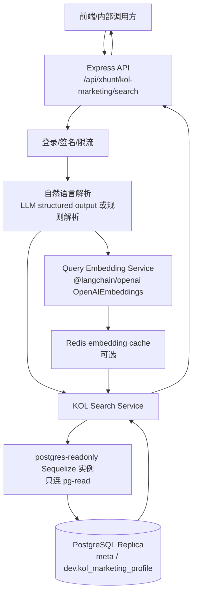

# KOL Marketing Profile 只读从库向量检索技术方案

> 适用项目：`enterprise-admin` / XHunt 后端服务  
> 目标表：`dev.kol_marketing_profile`  
> 方案日期：2026-08-06  
> 设计原则：只连 PostgreSQL 从库、只读、低延迟、可观测、不给生产主库增加压力。

---

## 1. 背景与目标

当前生产核查结果显示：

- 业务数据库是 PostgreSQL `17.6`，业务库名为 `meta`。
- 应用读入口为 `pg-read`，实际命中从库 `172.31.0.11:5432`。
- `dev.kol_marketing_profile` 已启用 pgvector：
  - 向量字段：`marketing_profile_embedding vector(1536)`
  - 向量索引：`idx_kol_marketing_profile_embedding_hnsw`
  - 索引类型：`hnsw`
  - opclass：`vector_cosine_ops`
  - 部分索引条件：`active AND marketing_profile_embedding IS NOT NULL`

本方案要实现一个接口，让用户可以用自然语言搜索 KOL，例如：

- “找适合 AI 项目早期增长合作的中文 KOL”
- “找粉丝 5 万以上、愿意做合作、偏 Web3/交易所方向的 KOL”
- “找英文区、适合 DeFi 项目、互动质量高的营销账号”

核心链路：

```text
自然语言 Query
  -> 解析语义与可过滤条件
  -> 用同一 embedding 模型生成 query embedding
  -> 只读从库 pgvector HNSW 检索
  -> 返回 KOL 列表 + 相似度 + 关键画像字段
```

---

## 2. 库选型建议

### 2.1 数据库访问：继续用 Sequelize，但向量检索用 raw SQL

推荐：**Sequelize v6 + `sequelize.query()` raw SQL**。

原因：

1. 项目已经使用 Sequelize 和 `pg`，无需额外引入新的 DB 连接池。
2. Sequelize 原生模型层不适合 pgvector：
   - Sequelize v6 没有项目当前可直接使用的 `DataTypes.VECTOR`。
   - `<=>`、`hnsw.ef_search`、`vector_cosine_ops` 这些 pgvector 能力更适合 raw SQL。
3. 可以复用项目现有风格：`QueryTypes.SELECT`、统一错误处理、统一日志与 request id。

不建议：

- 不建议为了这个功能直接用现有 `pgInstance`：当前 `src/models/postgres-start.js` 初始化时会 `sync({ alter: false })`，而且连接的是主 PG 配置，不适合作为“只读从库专用能力”。
- 不建议让 LLM 直接生成 SQL：有 SQL 注入、性能不可控、误查大表风险。
- 不建议查询时返回 embedding 字段：`vector(1536)` 字段较大，返回没有必要。

### 2.2 Embedding 生成：优先复用 `@langchain/openai`

项目已安装：

- `@langchain/openai`
- `langchain`
- `@langchain/core`

本地确认 `@langchain/openai` 已导出 `OpenAIEmbeddings`，因此推荐先使用它封装 query embedding 生成能力。

注意：**query embedding 必须和表里 `marketing_profile_embedding` 使用同一个 embedding 模型/维度/版本**。表内已有这些元数据字段：

- `embedding_dimensions`
- `embedding_model`
- `embedding_version`
- `embedding_input_hash`
- `embedding_generated_at`

如果表内存量向量不是 OpenAI 模型生成的，也必须使用相同 provider/model 生成查询向量；否则相似度结果会失真。

### 2.3 是否需要 npm `pgvector` 包？

第一版不需要。

- 只读查询可以把 JS embedding 数组转换为 pgvector literal：`[0.1,0.2,...]`，通过 bind 参数传给 SQL，再 `::vector`。
- 只有当后续要在 Node 里频繁写入/解析 vector 类型时，再考虑引入 `pgvector` npm 包。

---

## 3. 推荐架构



建议新增模块：

| 模块 | 建议路径 | 说明 |
|---|---|---|
| 只读 PG 实例 | `src/models/postgres-readonly.js` | 独立 Sequelize 实例，只连从库，不做 `sync` |
| Embedding 服务 | `src/xhunt/services/kol-marketing-embedding-service.js` | 生成 query embedding，校验维度，做缓存 |
| 搜索服务 | `src/xhunt/services/kol-marketing-search-service.js` | 拼接白名单 SQL，执行向量检索 |
| 自然语言解析 | `src/xhunt/services/kol-marketing-query-parser.js` | 把自然语言转成 semanticQuery + filters |
| API 路由 | `src/xhunt/api/kol-marketing-search.js` | 暴露 HTTP 接口 |
| API 挂载 | `src/apiServer.js` | 挂载到 `/api/xhunt/kol-marketing` |

---

## 4. 从库只读连接设计

### 4.1 环境变量

生产环境建议使用 Kubernetes Secret `secret/db:pg-read` 注入，不要硬编码连接串。

推荐环境变量：

```bash
# 只读从库连接串，生产由 secret/db:pg-read 注入
PG_READ_DATABASE_URL=<postgres-readonly-url>

# 可选：是否允许读连接意外落到主库。生产建议 false。
PG_READ_ALLOW_PRIMARY=false

# 连接池大小，按接口 QPS 调整。第一版保守。
PG_READ_POOL_MAX=3
PG_READ_POOL_MIN=0

# 单条 SQL 超时，保护从库。
PG_READ_STATEMENT_TIMEOUT_MS=1500
```

也可以兼容线上已有命名：`DATABASE_URL_READ`，但项目内建议统一封装成 `PG_READ_DATABASE_URL || DATABASE_URL_READ`。

### 4.2 独立 Sequelize 实例

新增 `src/models/postgres-readonly.js`，只做连接和健康校验，不加载一堆业务模型，不执行 `sync`。

示例：

```js
const { Sequelize, QueryTypes } = require("sequelize");

const readUrl = process.env.PG_READ_DATABASE_URL || process.env.DATABASE_URL_READ;

if (!readUrl) {
  throw new Error("PG read-only env incomplete: require PG_READ_DATABASE_URL or DATABASE_URL_READ");
}

const statementTimeout = Number(process.env.PG_READ_STATEMENT_TIMEOUT_MS || 1500);

const pgReadInstance = new Sequelize(readUrl, {
  dialect: "postgres",
  logging: process.env.PG_READ_LOGGING === "true",
  timezone: "+00:00",
  pool: {
    max: Number(process.env.PG_READ_POOL_MAX || 3),
    min: Number(process.env.PG_READ_POOL_MIN || 0),
    idle: 10000,
    acquire: 10000,
  },
  dialectOptions: {
    // 这些参数由 node-postgres 传给 PostgreSQL，能在连接级别保护只读与超时。
    options: [
      "-c default_transaction_read_only=on",
      `-c statement_timeout=${statementTimeout}`,
      "-c idle_in_transaction_session_timeout=3000",
      "-c application_name=xhunt-kol-marketing-readonly",
    ].join(" "),
  },
});

async function setupPostgresReadOnly() {
  await pgReadInstance.authenticate();

  const [row] = await pgReadInstance.query(
    `
      SELECT
        pg_is_in_recovery() AS in_recovery,
        current_database() AS database_name,
        inet_server_addr()::text AS server_addr,
        inet_server_port() AS server_port,
        current_setting('transaction_read_only') AS transaction_read_only
    `,
    { type: QueryTypes.SELECT }
  );

  const allowPrimary = process.env.PG_READ_ALLOW_PRIMARY === "true";
  if (!allowPrimary && !row.in_recovery) {
    throw new Error(
      `[PG ReadOnly] expected replica, but connected to primary ${row.server_addr}:${row.server_port}`
    );
  }

  console.log(
    `[PG ReadOnly] connected database=${row.database_name} server=${row.server_addr}:${row.server_port} recovery=${row.in_recovery} readonly=${row.transaction_read_only}`
  );
}

module.exports = {
  pgReadInstance,
  setupPostgresReadOnly,
};
```

### 4.3 为什么不复用 `postgres-start.js`

`src/models/postgres-start.js` 当前逻辑：

```js
await pgInstance.authenticate();
await pgInstance.sync({ alter: false });
```

虽然 `alter: false` 不会主动改表，但它仍然不是“只读从库专用连接”的最佳实践：

- 语义上这是主业务 PG 初始化。
- 新功能只需要读 `dev.kol_marketing_profile`，不需要加载全部模型。
- 从库上执行 `sync` 没必要，也容易让后续维护者误用。
- 单独实例可以强制 `default_transaction_read_only=on` 和更小 pool，风险更低。

---

## 5. `dev.kol_marketing_profile` 查询模型

### 5.1 已确认的核心字段

| 类型 | 字段 |
|---|---|
| 主键/身份 | `twitter_user_id`, `handle`, `name` |
| 状态/语言 | `active`, `language` |
| 标签数组 | `domains`, `keywords`, `cooperation_types`, `marketing_goals`, `project_stages` |
| 排名/粉丝 | `followers`, `ai_rank_global`, `ai_rank_cn`, `web3_rank_global`, `web3_rank_cn` |
| 营销画像 | `marketing_summary_cn`, `marketing_summary_en`, `willingness_level`, `willingness_score`, `willingness_reason`, `identity_tier` |
| 向量 | `marketing_profile_embedding vector(1536)` |
| embedding 元数据 | `embedding_dimensions`, `embedding_model`, `embedding_version`, `embedding_generated_at`, `needs_embedding_refresh` |

### 5.2 第一版接口不返回字段

不返回：

- `marketing_profile_embedding`
- 过大的内部证据字段，例如 `willingness_evidence`，除非前端明确需要。

原因：减少网络体积，避免泄露内部 AI 证据结构。

---

## 6. 自然语言搜索策略

### 6.1 推荐采用“结构化过滤 + 向量召回”的混合检索

纯向量检索可以理解语义，但不擅长严格条件，例如：

- 粉丝数大于 5 万
- 中文/英文
- 必须是 active
- 必须属于某些 domain

所以推荐：

```text
用户自然语言
  -> 解析成：semanticQuery + filters
  -> filters 用 SQL 精确过滤
  -> semanticQuery 生成 embedding 做向量排序
```

### 6.2 解析结果 Schema

建议解析成白名单 JSON：

```js
{
  semanticQuery: "AI 项目早期增长合作 KOL",
  filters: {
    language: "zh",                // 可选
    domains: ["ai", "web3"],       // 可选
    cooperationTypes: ["ama"],      // 可选
    marketingGoals: ["growth"],     // 可选
    projectStages: ["early"],       // 可选
    minFollowers: 50000,            // 可选
    maxFollowers: null,
    willingnessLevel: "high",       // 可选
    identityTier: null              // 可选
  },
  limit: 20
}
```

解析可以分两阶段：

1. **第一版**：前端传 `query + filters`，后端只做基础规则校验。
2. **增强版**：后端用现有 `src/lib/llm/structuredChat` + `zod` 解析自然语言，但 LLM 只产 JSON，绝不产 SQL。

---

## 7. 向量检索 SQL 设计

### 7.1 核心 SQL

必须包含和 HNSW 部分索引一致的条件：

```sql
p.active = true
AND p.marketing_profile_embedding IS NOT NULL
```

示例 SQL：

```sql
SELECT
  p.twitter_user_id,
  p.handle,
  p.name,
  p.language,
  p.domains,
  p.followers,
  p.ai_rank_global,
  p.ai_rank_cn,
  p.web3_rank_global,
  p.web3_rank_cn,
  p.marketing_summary_cn,
  p.marketing_summary_en,
  p.keywords,
  p.cooperation_types,
  p.marketing_goals,
  p.project_stages,
  p.willingness_level,
  p.willingness_score,
  p.willingness_reason,
  p.identity_tier,
  p.embedding_model,
  p.embedding_version,
  p.embedding_generated_at,
  1 - (p.marketing_profile_embedding <=> $embedding::vector) AS similarity
FROM dev.kol_marketing_profile p
WHERE p.active = true
  AND p.marketing_profile_embedding IS NOT NULL
  -- 动态追加白名单过滤条件
ORDER BY p.marketing_profile_embedding <=> $embedding::vector
LIMIT $limit;
```

说明：

- `<=>` 是 pgvector cosine distance。
- `1 - distance` 可作为 similarity，越接近 1 越相似。
- 不要 `SELECT *`。
- 不要返回 `marketing_profile_embedding`。
- `LIMIT` 必须设置上限，建议最大 50。

### 7.2 动态过滤条件白名单

只允许以下字段进入 WHERE，并且全部用 bind 参数：

| 条件 | SQL 形式 |
|---|---|
| 语言 | `p.language = $language` |
| 最小粉丝 | `p.followers >= $minFollowers` |
| 最大粉丝 | `p.followers <= $maxFollowers` |
| domains 数组重叠 | `p.domains && $domains::text[]` |
| keywords 数组重叠 | `p.keywords && $keywords::text[]` |
| cooperation_types 数组重叠 | `p.cooperation_types && $cooperationTypes::text[]` |
| marketing_goals 数组重叠 | `p.marketing_goals && $marketingGoals::text[]` |
| project_stages 数组重叠 | `p.project_stages && $projectStages::text[]` |
| willingness_level | `p.willingness_level = $willingnessLevel` |
| identity_tier | `p.identity_tier = $identityTier` |

### 7.3 Sequelize raw query 示例

```js
const { QueryTypes } = require("sequelize");
const { pgReadInstance } = require("../../models/postgres-readonly");

function vectorToPgLiteral(values) {
  if (!Array.isArray(values) || values.length !== 1536) {
    throw new Error("embedding dimension must be 1536");
  }
  return `[${values.map((value) => Number(value).toFixed(8)).join(",")}]`;
}

async function searchKolMarketingProfiles({ embedding, filters = {}, limit = 20 }) {
  const clauses = [
    "p.active = true",
    "p.marketing_profile_embedding IS NOT NULL",
  ];

  const bind = {
    embedding: vectorToPgLiteral(embedding),
    limit: Math.min(Math.max(Number(limit) || 20, 1), 50),
  };

  if (filters.language) {
    clauses.push("p.language = $language");
    bind.language = filters.language;
  }

  if (Number.isFinite(filters.minFollowers)) {
    clauses.push("p.followers >= $minFollowers");
    bind.minFollowers = filters.minFollowers;
  }

  if (Array.isArray(filters.domains) && filters.domains.length > 0) {
    clauses.push("p.domains && $domains::text[]");
    bind.domains = filters.domains;
  }

  const sql = `
    SELECT
      p.twitter_user_id,
      p.handle,
      p.name,
      p.language,
      p.domains,
      p.followers,
      p.marketing_summary_cn,
      p.marketing_summary_en,
      p.keywords,
      p.cooperation_types,
      p.marketing_goals,
      p.project_stages,
      p.willingness_level,
      p.willingness_score,
      p.willingness_reason,
      p.identity_tier,
      1 - (p.marketing_profile_embedding <=> $embedding::vector) AS similarity
    FROM dev.kol_marketing_profile p
    WHERE ${clauses.join(" AND ")}
    ORDER BY p.marketing_profile_embedding <=> $embedding::vector
    LIMIT $limit
  `;

  return pgReadInstance.query(sql, {
    bind,
    type: QueryTypes.SELECT,
  });
}
```

---

## 8. Embedding 服务设计

### 8.1 配置

```bash
KOL_SEARCH_EMBEDDING_PROVIDER=openai-compatible
KOL_SEARCH_EMBEDDING_MODEL=<必须和表内 embedding_model 一致>
KOL_SEARCH_EMBEDDING_DIMENSIONS=1536
KOL_SEARCH_EMBEDDING_CACHE_TTL_SECONDS=86400
```

如果复用现有 LLM 配置，可使用：

- `LLM_API_KEY`
- `LLM_BASE_URL`

但最好单独区分 embedding 配置，避免 chat model 和 embedding model 混用。

### 8.2 示例封装

```js
const crypto = require("crypto");
const { OpenAIEmbeddings } = require("@langchain/openai");

function createEmbeddingClient() {
  return new OpenAIEmbeddings({
    model: process.env.KOL_SEARCH_EMBEDDING_MODEL,
    apiKey: process.env.KOL_SEARCH_EMBEDDING_API_KEY || process.env.LLM_API_KEY,
    configuration: {
      baseURL: process.env.KOL_SEARCH_EMBEDDING_BASE_URL || process.env.LLM_BASE_URL,
    },
  });
}

function normalizeQuery(text) {
  return String(text || "").trim().replace(/\s+/g, " ").slice(0, 500);
}

function getEmbeddingCacheKey(text, model) {
  const hash = crypto.createHash("sha256").update(`${model}\n${normalizeQuery(text)}`).digest("hex");
  return `kol_marketing:embedding:${hash}`;
}
```

### 8.3 维度校验

生成 query embedding 后必须校验：

```js
if (embedding.length !== Number(process.env.KOL_SEARCH_EMBEDDING_DIMENSIONS || 1536)) {
  throw new Error(`embedding dimension mismatch: ${embedding.length}`);
}
```

如果后续表内出现多种 `embedding_model` / `embedding_version`，接口需要固定只查某一版本，或按版本分索引与查询入口。

---

## 9. API 设计

### 9.1 路由

建议新增：

```text
POST /api/xhunt/kol-marketing/search
```

是否需要登录取决于产品定位：

- 如果给 XHunt 登录用户使用：加 `authenticateToken` + 现有安全中间件 + Redis 限流。
- 如果只给管理后台使用：挂到 admin 路由并加 `adminAuth`。
- 如果后续对外开放：必须加签名、限流、配额、审计日志。

### 9.2 请求体

```json
{
  "query": "找适合 AI 项目早期增长合作的中文 KOL",
  "filters": {
    "language": "zh",
    "domains": ["ai", "web3"],
    "minFollowers": 50000,
    "willingnessLevel": "high"
  },
  "limit": 20,
  "debug": false
}
```

### 9.3 响应体

```json
{
  "code": 200,
  "message": "success",
  "data": {
    "query": "找适合 AI 项目早期增长合作的中文 KOL",
    "semanticQuery": "AI 项目早期增长合作 中文 KOL",
    "filters": {
      "language": "zh",
      "domains": ["ai", "web3"],
      "minFollowers": 50000,
      "willingnessLevel": "high"
    },
    "embeddingModel": "<model>",
    "items": [
      {
        "twitterUserId": "...",
        "handle": "...",
        "name": "...",
        "language": "zh",
        "followers": 123456,
        "domains": ["ai", "web3"],
        "keywords": ["..."],
        "cooperationTypes": ["..."],
        "willingnessLevel": "high",
        "willingnessScore": "0.82",
        "identityTier": "...",
        "marketingSummaryCn": "...",
        "similarity": 0.78
      }
    ]
  }
}
```

---

## 10. 性能与生产保护

### 10.1 查询保护

必须做：

1. 只连 `pg-read` 从库。
2. 使用专用只读 DB 用户。
3. Sequelize read-only 实例不执行 `sync`。
4. 连接级设置：
   - `default_transaction_read_only=on`
   - `statement_timeout=1500ms`
   - `idle_in_transaction_session_timeout=3000ms`
   - `application_name=xhunt-kol-marketing-readonly`
5. `LIMIT` 最大 50。
6. 默认 `active = true AND marketing_profile_embedding IS NOT NULL`，命中 HNSW 部分索引。
7. 不做 `COUNT(*)`，不做大 OFFSET。
8. 不返回向量字段。

### 10.2 缓存建议

| 缓存 | Key | TTL | 说明 |
|---|---|---|---|
| Query embedding | `kol_marketing:embedding:{sha256}` | 1 天 | 节省 embedding API 调用 |
| Search result | `kol_marketing:search:{sha256}` | 30-120 秒 | 热门搜索短缓存，避免重复打从库 |

第一版可以只做 embedding cache；搜索结果是否缓存看产品实时性要求。

### 10.3 HNSW 参数

默认先不调。如果召回质量不够，可在单次查询事务内设置：

```sql
SET LOCAL hnsw.ef_search = 80;
```

注意：`ef_search` 越高，召回可能更好，但 CPU/耗时更高。建议压测后再调整。

---

## 11. 权限设计

生产建议创建专用只读用户，且只给目标表 SELECT 权限。

DBA 操作示例，注意不要把密码写进代码仓库：

```sql
CREATE USER xhunt_kol_readonly WITH PASSWORD '<由密钥系统生成>';
GRANT CONNECT ON DATABASE meta TO xhunt_kol_readonly;
GRANT USAGE ON SCHEMA dev TO xhunt_kol_readonly;

GRANT SELECT (
  twitter_user_id,
  handle,
  name,
  active,
  language,
  domains,
  followers,
  ai_rank_global,
  ai_rank_cn,
  web3_rank_global,
  web3_rank_cn,
  marketing_summary_cn,
  marketing_summary_en,
  keywords,
  cooperation_types,
  marketing_goals,
  project_stages,
  willingness_level,
  willingness_score,
  willingness_reason,
  identity_tier,
  marketing_profile_embedding,
  embedding_dimensions,
  embedding_model,
  embedding_version,
  embedding_generated_at
) ON dev.kol_marketing_profile TO xhunt_kol_readonly;

ALTER ROLE xhunt_kol_readonly SET default_transaction_read_only = on;
ALTER ROLE xhunt_kol_readonly SET statement_timeout = '1500ms';
ALTER ROLE xhunt_kol_readonly SET idle_in_transaction_session_timeout = '3000ms';
```

---

## 12. 观测与日志

建议记录：

- `requestId`
- `clientKey` / 用户身份
- 原始 query 长度，不记录超长原文或敏感内容
- `semanticQuery`
- filters 摘要
- embedding model/version
- DB 耗时
- 返回数量
- 是否命中 cache
- 错误类型：embedding error / DB timeout / validation error

不要记录：

- DB 连接串
- embedding API key
- 完整大向量
- 过长用户输入

可以接入现有：

- `src/lib/perf-monitor/`
- `recordGenericStat`
- Morgan request id 日志

---

## 13. 实施步骤

### Phase 1：最小可用版

1. 新增 `src/models/postgres-readonly.js`。
2. `src/apiServer.js` 启动时调用 `setupPostgresReadOnly()`。
3. 新增 embedding service，使用和存量数据一致的 embedding model。
4. 新增 search service，用 raw SQL 查询 `dev.kol_marketing_profile`。
5. 新增 API：`POST /api/xhunt/kol-marketing/search`。
6. 仅支持：`query`、`language`、`domains`、`minFollowers`、`limit`。

### Phase 2：自然语言增强

1. 使用 `structuredChat + zod` 解析自然语言过滤条件。
2. 支持更多白名单 filters：`cooperation_types`、`marketing_goals`、`project_stages`、`willingness_level`。
3. 增加 embedding cache。
4. 加 Redis 用户级限流。

### Phase 3：质量优化

1. 搜索结果重排：`similarity + followers + willingness_score + rank`。
2. 加解释字段：为什么推荐这个 KOL。
3. 根据点击/收藏/转化做离线评估。
4. 支持多语言 query rewrite。

---

## 14. 测试建议

不直接在生产做重测试。建议：

1. 本地单元测试：
   - query parser 输出白名单 JSON。
   - SQL builder 不拼接用户输入，只生成 bind 参数。
   - limit 上限生效。
   - embedding 维度校验。

2. 开发/测试库集成测试：
   - `setupPostgresReadOnly()` 连接只读库。
   - 查询结果不返回 embedding。
   - filters 生效。

3. 生产灰度：
   - 只对内部用户开放。
   - limit 先固定 10-20。
   - statement timeout 先设 1.5 秒。
   - 观察从库 CPU、慢查询、接口 P95/P99。

4. 索引验证：
   - 生产只允许使用 `EXPLAIN`，避免 `EXPLAIN ANALYZE` 在高峰期真实执行重查询。
   - 确认计划使用 `idx_kol_marketing_profile_embedding_hnsw`。

---

## 15. 关键风险与规避

| 风险 | 规避 |
|---|---|
| 误连主库 | 启动时校验 `pg_is_in_recovery()`，生产不允许 primary |
| 写入风险 | 专用只读用户 + `default_transaction_read_only=on` |
| LLM 生成危险 SQL | LLM 只产 JSON，SQL 由白名单 builder 生成 |
| 从库压力 | 小连接池、statement timeout、limit、缓存、限流 |
| embedding 模型不一致 | 配置固定模型，启动/运行时校验维度和版本 |
| SQL 注入 | 所有值用 bind 参数，字段名/排序只用白名单 |
| 返回数据过大 | 禁止 `SELECT *`，不返回 vector/evidence 大字段 |

---

## 16. 推荐结论

坤哥，这个功能最稳的技术路线是：

1. **数据库层继续用 Sequelize**，但新增 `postgres-readonly.js` 独立只读实例。
2. **向量检索用 raw SQL**，不要硬套 Sequelize Model。
3. **embedding 用项目已有的 `@langchain/openai` 的 `OpenAIEmbeddings`**，但模型必须和表里向量生成模型一致。
4. **自然语言不要直接变 SQL**，先变成结构化 filters，再由后端白名单 SQL builder 查询。
5. **生产只连从库 `pg-read`，配专用只读用户、小连接池、statement_timeout、limit、缓存和限流**。
