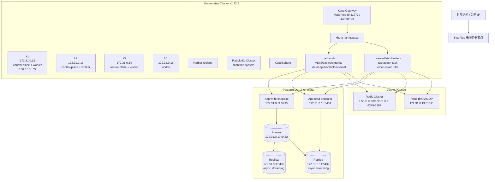

# 生产 K8s / 数据库只读核查报告

> 核查日期：2026-08-06  
> 核查入口：`ssh root@150.5.161.65 -p 22`  
> 核查原则：只读；未执行写入、重启、扩缩容、部署、DDL/DML、全表扫描；未在本文档记录任何数据库/Redis/RabbitMQ 密码、Token 或 Secret 明文。

## 1. 结论摘要

1. **150.5.161.65 是 Kubernetes 服务器**。
   - 登录主机名：`k1`
   - 登录身份：`root`，UID 0
   - 内网 IP：`172.31.0.12`
   - K8s 节点角色：`control-plane,worker`
   - Kubernetes 版本：`v1.32.8`
   - 容器运行时：`containerd://1.7.28`

2. **XHunt 业务服务已连接生产数据库**。
   - `xhunt` namespace 下多数 Deployment 通过 Kubernetes Secret `xhunt/db` 注入数据库连接。
   - 主要 Secret key：`pg-write`、`pg-read`、`redis-cluster`、`rabbitmq`。
   - 已用只读 SQL 验证 PG 连接可用。

3. **数据库是 PostgreSQL**。
   - PostgreSQL server version：`17.6 (Ubuntu 17.6-2.pgdg24.04+1)`
   - 业务库名：`meta`
   - 写入口：`172.31.0.11:5433`，实际连接到主库 `172.31.0.10:5432`
   - 读入口：`172.31.0.11:5434`，实际连接到从库 `172.31.0.11:5432`
   - 主从状态：主库 `172.31.0.10` 正在向 `172.31.0.9`、`172.31.0.11` 两个异步从库 streaming。

4. **`dev.kol_marketing_profile` 已做 pgvector 向量化**。
   - PG 扩展：`vector 0.8.1`
   - 向量字段：`marketing_profile_embedding vector(1536)`
   - 向量索引：`idx_kol_marketing_profile_embedding_hnsw`
   - 索引类型：`hnsw`
   - 距离/相似度 opclass：`vector_cosine_ops`
   - 部分索引条件：`active AND marketing_profile_embedding IS NOT NULL`

---

## 2. Kubernetes 集群核查

### 2.1 当前登录服务器

| 项目 | 值 |
|---|---|
| 公网 SSH | `150.5.161.65:22` |
| 主机名 | `k1` |
| 内网 IP | `172.31.0.12` |
| OS | Ubuntu 24.04 LTS |
| Kernel | `6.8.0-55-generic` |
| 身份 | `root`, UID 0 |

### 2.2 K8s 节点

| 节点 | 状态 | 角色 | 内网 IP | K8s 版本 | 容器运行时 |
|---|---|---|---|---|---|
| `k1` | Ready | control-plane,worker | `172.31.0.12` | v1.32.8 | containerd 1.7.28 |
| `k2` | Ready | control-plane,worker | `172.31.0.13` | v1.32.8 | containerd 1.7.28 |
| `k3` | Ready | control-plane,worker | `172.31.0.14` | v1.32.8 | containerd 1.7.28 |
| `k5` | Ready | worker | `172.31.0.16` | v1.32.8 | containerd 1.7.13 |

### 2.3 主要 namespace

- `xhunt`：业务服务
- `kong`：Kong Gateway / Controller
- `rabbitmq-system`：RabbitMQ Cluster
- `harbor`：镜像仓库 Harbor
- `kubesphere-system`：KubeSphere 控制面
- `velero`：备份组件
- `kube-system`：CoreDNS、Calico、kube-proxy 等系统组件

---

## 3. 业务服务与数据库连接情况

### 3.1 XHunt 主要服务

`xhunt` namespace 中存在大量业务 Deployment，包括但不限于：

- API / Backend：`backend-v1-v1`、`backend-v2-v1`、`backend-cookie-v1`、`backend-external-v1`、`xhunt-api-v1`
- 前台/信息服务：`front-server-v1`、`info-server-v1`、`internal-server-v1`
- Fetch/Crawler：`fetch-server-v1`、`crawler-server-v1`、`crawler-server2-v1`、`crawler-cookie-server-v1`
- 数据任务：`twitter-task-*`、`crawler-task-*`、`token-task-analysis` 等

这些服务基本通过 `secret/db` 注入数据库、Redis、RabbitMQ 等连接信息。

### 3.2 数据库连接 Secret 引用

典型引用方式：

| 环境变量 | 来源 | 用途判断 |
|---|---|---|
| `DATABASE_URL` | `secret/db:pg-write` | PostgreSQL 写入口 |
| `DATABASE_URL_READ` / `DATABASE_URL_BACKUP` | `secret/db:pg-read` | PostgreSQL 读入口 / 备库入口 |
| `REDIS_URL` | `secret/db:redis-cluster` | Redis Cluster |
| `RABBITMQ_URL` | `secret/db:rabbitmq` | RabbitMQ |

> 安全说明：Secret 明文未写入本文档。

### 3.3 已确认的非敏感连接端点

| 类型 | 入口 | 数据库/说明 |
|---|---|---|
| PostgreSQL 写入口 | `172.31.0.11:5433` | DB: `meta` |
| PostgreSQL 读入口 | `172.31.0.11:5434` | DB: `meta` |
| RabbitMQ | `172.31.0.13:31391` | AMQP 入口，凭据已隐藏 |
| Redis Cluster | `172.31.0.10/172.31.0.11` 的 `6379-6381` 端口 | 凭据已隐藏 |

---

## 4. PostgreSQL 主从关系

### 4.1 只读验证 SQL 结果摘要

| 连接名 | 应用入口 | 实际服务端 | `pg_is_in_recovery()` | 角色判断 |
|---|---|---|---|---|
| `pg-write` | `172.31.0.11:5433` | `172.31.0.10:5432` | `false` | 主库 |
| `pg-read` | `172.31.0.11:5434` | `172.31.0.11:5432` | `true` | 从库 |

### 4.2 复制状态

在主库侧看到的复制流：

| Standby application | Standby IP | 状态 | 同步模式 |
|---|---|---|---|
| `pg-meta-1` | `172.31.0.9` | streaming | async |
| `pg-meta-3` | `172.31.0.11` | streaming | async |

结论：

- **主库**：`172.31.0.10:5432`
- **从库**：`172.31.0.9:5432`、`172.31.0.11:5432`
- 应用写入口 `172.31.0.11:5433` 应为转发/代理入口，最终命中主库 `172.31.0.10:5432`。
- 应用读入口 `172.31.0.11:5434` 命中从库 `172.31.0.11:5432`。

---

## 5. `dev.kol_marketing_profile` 向量化情况

### 5.1 PG 扩展

| 扩展 | 版本 |
|---|---|
| `vector` | `0.8.1` |
| `pg_trgm` | `1.6` |

### 5.2 表存在性

- `dev.kol_marketing_profile`：存在。

### 5.3 向量相关字段

| 字段 | 类型 | 说明 |
|---|---|---|
| `marketing_profile_embedding` | `vector(1536)` | 主要向量字段，1536 维 embedding |
| `embedding_dimensions` | `integer` | 维度记录字段 |
| `embedding_model` | `text` | embedding 模型名 |
| `embedding_version` | `text` | embedding 版本 |
| `embedding_input_hash` | `text` | embedding 输入 hash |
| `embedding_generated_at` | `timestamptz` | embedding 生成时间 |
| `needs_embedding_refresh` | `boolean` | 是否需要刷新 embedding |

严格按 pgvector 类型判断，真正的向量列是：

```text
marketing_profile_embedding vector(1536)
```

### 5.4 向量索引

```sql
CREATE INDEX idx_kol_marketing_profile_embedding_hnsw
ON dev.kol_marketing_profile
USING hnsw (marketing_profile_embedding vector_cosine_ops)
WITH (m='16', ef_construction='64')
WHERE (active AND (marketing_profile_embedding IS NOT NULL));
```

结论：

- 已建立 HNSW 向量近邻索引。
- 使用 cosine 相似度/距离 opclass：`vector_cosine_ops`。
- 只索引 `active = true` 且 `marketing_profile_embedding IS NOT NULL` 的记录。

---

## 6. 当前可见整体架构图



---

## 7. 本次核查使用的只读方式

- `ssh` 登录目标服务器。
- `kubectl get ...` 查看节点、namespace、Deployment、Service、Secret 引用关系。
- 仅读取 Secret 中连接串并在内存中解析非敏感端点；未落盘、未输出密码。
- 使用 PostgreSQL 只读会话查询：
  - `pg_is_in_recovery()` 判断主从角色。
  - `pg_stat_replication` 查看主库复制状态。
  - `pg_extension`、`pg_attribute`、`pg_indexes`、`pg_opclass` 查看表结构与向量索引元数据。
- 未执行 `INSERT/UPDATE/DELETE/DDL`，未跑 `COUNT(*)`、全表扫描或业务查询。
