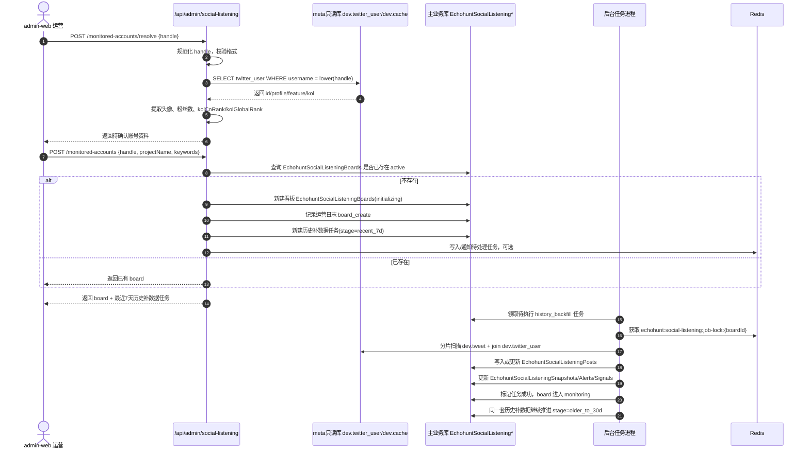
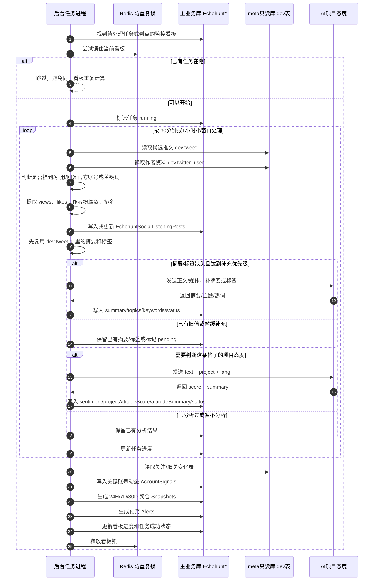
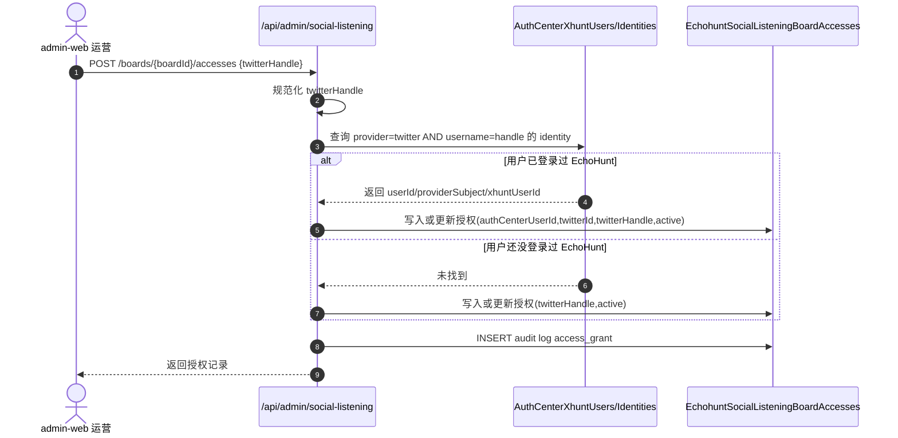
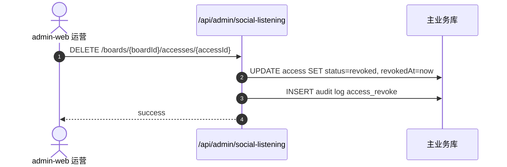
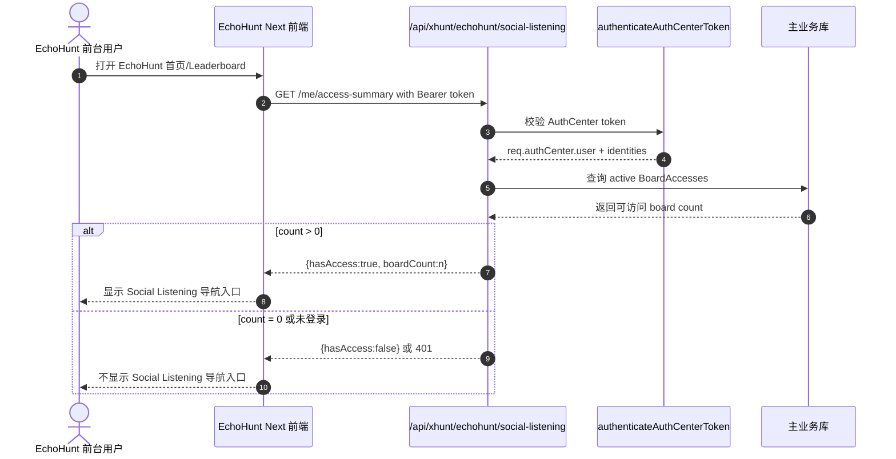
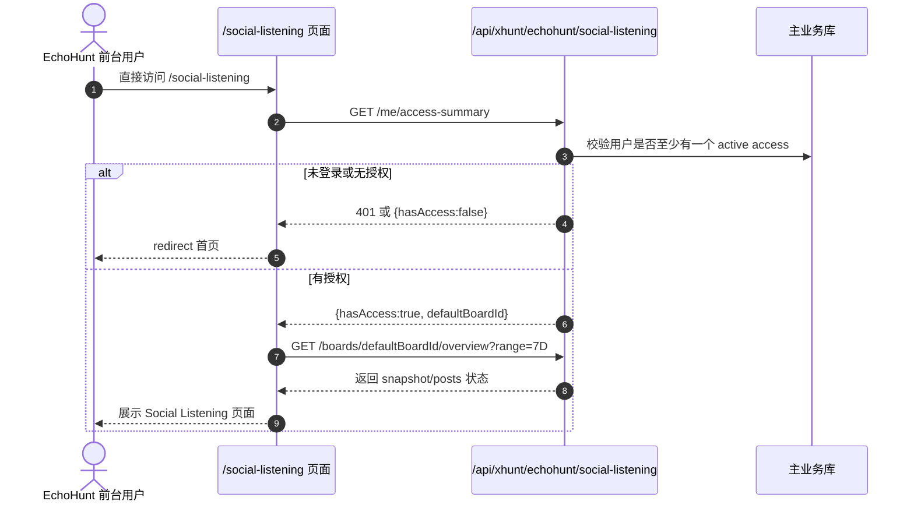
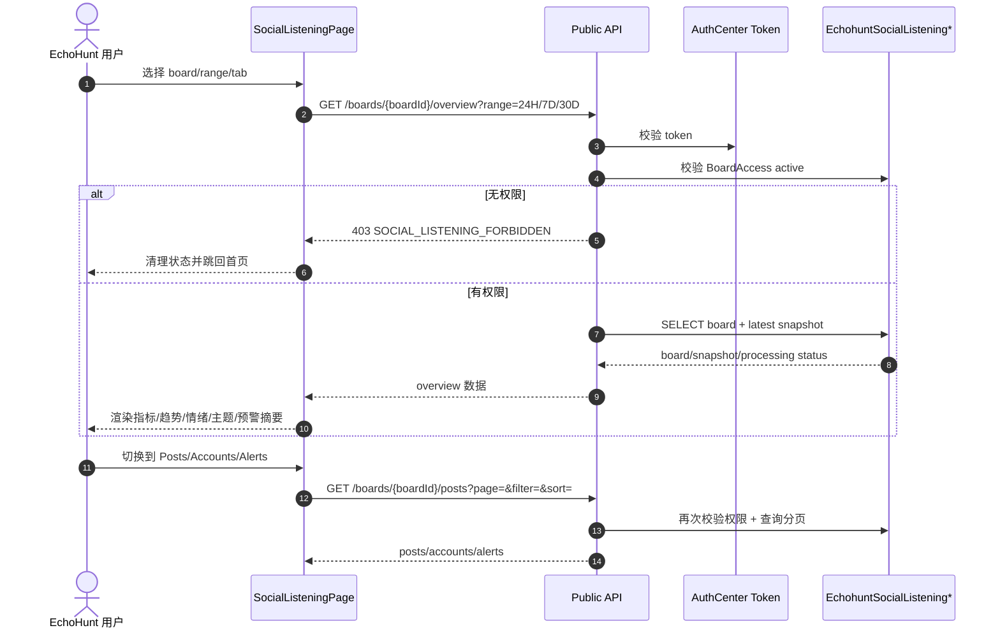
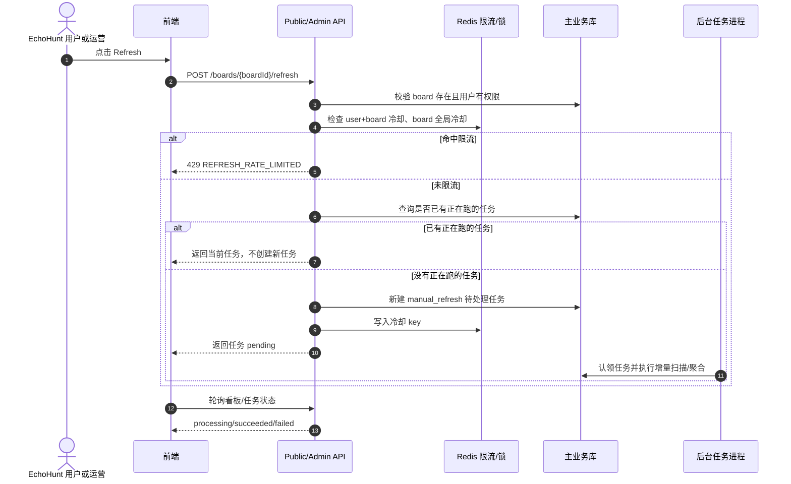
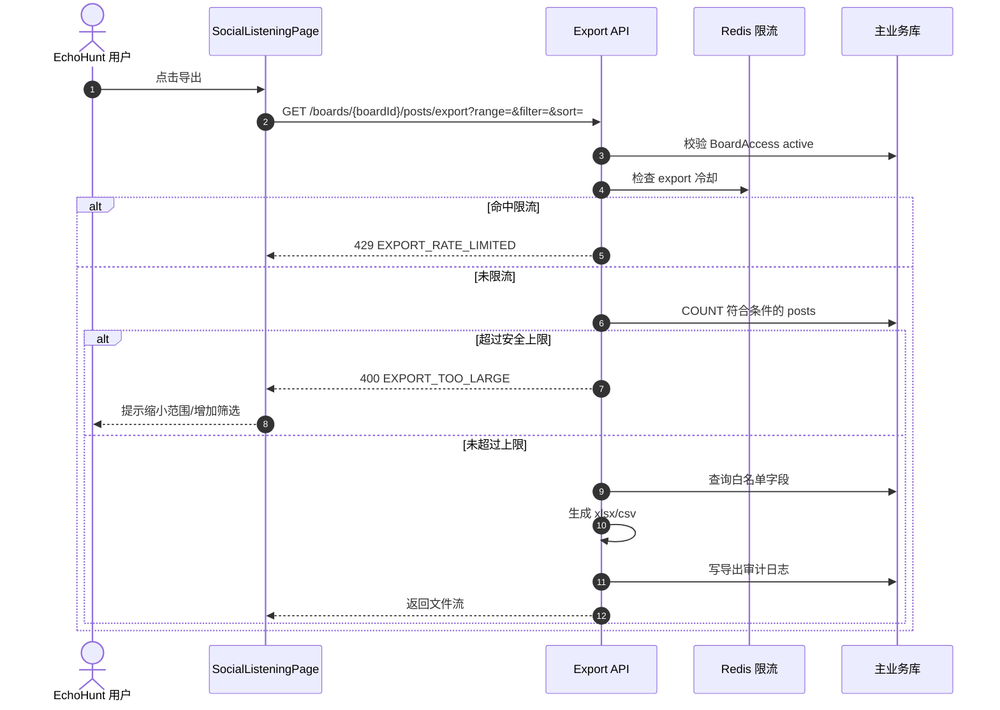
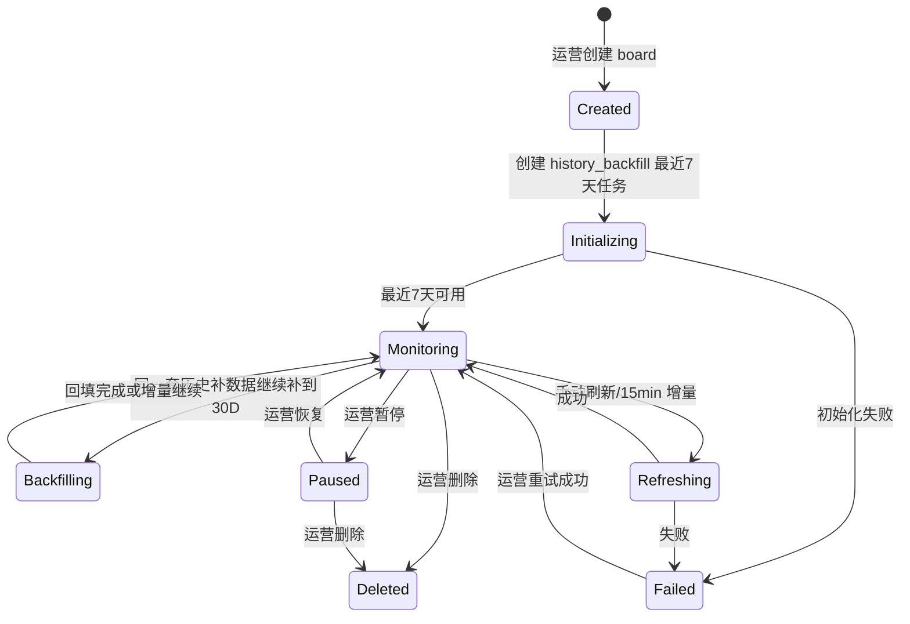

# EchoHunt Social Listening V1 技术实现文档（研发讨论版）

> 生成日期：2026-08-31  
> 后端仓库：`/Users/luykin/Documents/mac-work/luykin-chaineye-service`  
> 前端仓库：`/Users/luykin/Documents/mac-work-new/XHunt.website/apps/echohunt/app`  
> 状态：方案稿，含待确认项；不包含线上改库/改数据操作。

## 1. 依据与当前确认状态

### 1.0 坤哥本轮已确认结论

- 新增 Social Listening 业务表放在**当前 XHunt 主业务 PostgreSQL 库**，不放`meta` 只读库的 `dev` schema。
- 新增表/模型命名不再使用 `xhunt` 前缀，统一使用 `echohunt` 前缀，例如 `EchohuntSocialListeningBoards`。
- `admin-web` 新增权限点：`social-listening`，用于维护被监控账号名单、授权关系、任务/异常。
- EchoHunt 前端：只有被分配了至少一个被监控账号的 EchoHunt 账号才展示 Social Listening 页面入口；无授权用户直接访问 `/social-listening` 时**跳回首页**。
- 手动刷新需要限流；导出也需要限制在安全范围内。
- 关注/取关表、华语排名字段已结合旧代码和只读库输出确认可用：华语排名优先取 `dev.twitter_user.feature.rank.kolCnRank`；关注/取关从 `dev.twitter_user_follow`、`dev.twitter_user_unfollow`、`dev.project_follow` 中取，最终产品口径再定。

### 1.1 已阅读资料

- PRD：`echohuntdemo/docs/EchoHunt_Social_Listening_V1_核心产品说明_HAN_v2.md`
- 原型：`echohuntdemo/social-listening-demo/index.html`
- 已接入静态页：`XHunt.website/apps/echohunt/app/social-listening/page.tsx`
- 静态页组件：`XHunt.website/apps/echohunt/components/social-listening/SocialListeningPage.tsx`
- 静态 Mock 数据：`XHunt.website/apps/echohunt/components/social-listening/mock-data.ts`
- Rust 参考文档：`/Users/luykin/Desktop/bnb_collab_alert.md`
- 旧后端告警任务：`cryptohunt-backend-v2/server/src/bin/bnb_collab_alert.rs`、`bybit_collab_alert.rs`、`project_collab.rs`
- 旧后端 AI 封装：`cryptohunt-backend-v2/server/src/ai/client.rs`
- 旧后端 Twitter 服务/DAO：`cryptohunt-backend-v2/server/src/service/twitter.rs`、`cryptohunt-backend-v2/db/src/twitter/tweet.rs`
- 当前后端入口与约定：`src/apiServer.js`、`src/models/postgres-start.js`、`src/singletonJobsServer.js`、`src/xhunt/api/echohunt.js`、`src/xhunt/auth-center/middleware/auth.js`

### 1.2 线上数据库只读探查状态

已按“只看不改”的原则尝试通过本地环境里的只读 PostgreSQL 配置连接`meta` 只读库 `dev` schema，连接被当前执行沙箱拦截：

```text
SequelizeConnectionError connect EPERM 172.31.0.11:5434
```

也已按坤哥提供的服务器尝试 SSH：

```text
ssh root@150.5.161.65 -p 22
ssh: connect to host 150.5.161.65 port 22: Operation not permitted
```

因此，本文对既有 X/Twitter 数据表的描述目前来自：

1. `/Users/luykin/Desktop/bnb_collab_alert.md`
2. `/Users/luykin/Documents/mac-work-new/cryptohunt-backend-v2/schema.md`
3. `cryptohunt-backend-v2/db/src/twitter/*.rs` DAO/结构体定义
4. `cryptohunt-backend-v2/server/src/bin/bnb_collab_alert.rs`、`bybit_collab_alert.rs`、`server/src/ai/client.rs`
5. 坤哥在服务器/只读从库执行 `psql` 后提供的真实表结构输出，时间：2026-08-31 17:52 左右。

已确认真实存在并能只读查询的表：

- `dev.tweet`
- `dev.twitter_user`
- `dev.cache`
- `dev.twitter_user_follow`
- `dev.twitter_user_unfollow`
- `dev.project_follow`
- `dev.tweet_metric_snapshot`

当前仍未由我本地直接连通 SSH/DB，原因是执行环境限制；但坤哥提供的只读输出已经足够更新 V1 方案里的核心表结构判断。

## 2. V1 产品边界

Social Listening V1 要实现：

1. 运营人员在 `admin-web` 维护“被监控账号名单”，每个被监控账号对应一个 Social Listening 看板。
2. 新看板先产出最近 7 天数据，随后补齐最近 30 天数据。
3. 监控中看板每 15 分钟更新一次；手动刷新立即触发一次，但同一看板不并发跑重复任务。
4. 运营人员可以把某个被监控账号/看板分配给一个或多个 EchoHunt X 登录账号查看。
5. EchoHunt 用户只有被分配了至少一个被监控账号时，才可以看见 Social Listening 页面入口；未分配用户不展示入口，直接访问 `/social-listening` 时跳回首页。
6. 全页统一支持 `24H / 7D / 30D` 时间范围。
7. 页面模块：概览指标、趋势/情绪/主题、关键事件、关键账号动态、预警信号、帖子列表、帖子导出。
8. 数据为空、处理中、失败、历史数据不足必须分别表达，不能用 Mock 或 0 伪装。

V1 不做：工单处置系统、预警“已恢复/优先级/处理人”状态、客户跨看板授权管理。

## 3. 当前系统落点

### 3.1 后端落点

当前 API 服务入口为 `src/apiServer.js`：

- EchoHunt 前台业务已经挂载在：`/api/xhunt/echohunt`
- 前端 Next 代理 `/api/echohunt/[...path]` 默认转发到：`https://kb.xhunt.ai/api/xhunt/echohunt`
- 认证中心 Token 校验中间件：`authenticateAuthCenterToken()`
- 管理后台鉴权中间件：`adminAuth`
- 单实例任务进程：`src/singletonJobsServer.js`，PM2 名称 `luykin-chaineye-jobs`
- 当前主业务 PostgreSQL 模型集中在 `src/models/postgres-start.js`，迁移位于 `migrations-pg/`
- 现有 K8s 只读/写 PostgreSQL 连接封装：`src/infra/k8s/postgres-readonly.js`、`src/infra/k8s/postgres-write.js`

建议新增目录：

```text
src/xhunt/social-listening/
├── api/
│   ├── public.js              # EchoHunt 前台接口：客户/内部人员看板使用
│   └── admin.js               # 运营管理接口：创建、授权、任务、异常
├── services/
│   ├── board-service.js
│   ├── data-source.js         # 查询 dev.tweet/dev.twitter_user/dev.cache
│   ├── ingest-service.js      # 历史补数据/15min增量入库
│   ├── analysis-service.js    # 复用 dev.tweet.ai + 项目态度 AI
│   ├── aggregate-service.js   # 指标/趋势/摘要快照
│   ├── alert-service.js       # 四类预警检测与合并
│   ├── export-service.js      # xlsx 导出
│   └── scheduler.js           # 周期任务调度
└── utils/
    ├── twitter.js             # handle/post url 解析
    ├── text-normalize.js      # 复用 Rust 文档里的 norm_tweet 逻辑
    └── concurrency.js
```

### 3.2 前端落点

当前 `apps/echohunt/app/social-listening/page.tsx` 只是：

```tsx
import LeaderboardPage from '@/components/LeaderboardPage';

export default function SocialListeningRoutePage() {
  return <LeaderboardPage initialView="socialListening" />;
}
```

实际 UI 在 `components/social-listening/SocialListeningPage.tsx`，目前全部来自 `mock-data.ts`。需要把 Mock 替换为真实 API 状态机，并保留现有视觉结构。

建议新增：

```text
apps/echohunt/lib/social-listening-api.ts
apps/echohunt/components/social-listening/types.ts
apps/echohunt/components/social-listening/hooks.ts
apps/echohunt/components/social-listening/SocialListeningPage.tsx  # 原文件改造
```

前端请求继续走已有 Next 代理：`/api/echohunt/social-listening/...`，认证继续复用 `lib/echohunt-api.ts` 的 `echohuntApiFetch()` 和 localStorage token。

### 3.3 前端入口可见性门禁

`LeaderboardPage` 当前会固定提供 `socialListening` 导航入口。需要改成：

1. 用户未登录时：不展示 Social Listening 入口。
2. 用户已登录后：调用 `/api/echohunt/social-listening/me/access-summary`。
3. 返回 `hasAccess=false` 或可访问被监控账号数量为 0：不展示 Social Listening 导航入口。
4. 返回 `hasAccess=true`：展示 Social Listening 入口；如果用户直接访问 `/social-listening`，进入其默认/最近访问的被监控账号看板。
5. 用户直接访问 `/social-listening` 但无权限：跳回首页，不能展示 Social Listening 真实页面数据，也不能用 Mock/历史缓存假装有权限。

后端必须在所有 Social Listening API 中重复校验授权，前端隐藏入口只是体验优化，不能作为安全边界。

## 4. `meta` 只读库 `dev` schema复用方式

Rust 文档确认的既有数据源位于 PostgreSQL `dev` schema：

| 表 | 读写 | 作用 |
|---|---|---|
| `dev.tweet` | 只读 | 推文主表，按 `create_time` 扫描，含正文、关联推文 ID、统计、AI、mention 等 JSON 字段。 |
| `dev.twitter_user` | 只读 | 作者 profile，含 `profile.username_raw`、`profile.followers_count`、`ai.is_cn` 等。 |
| `dev.cache` | 只读 | KOL 排名快照、旧 BNB 告警去重缓存；V1 默认只读复用，不写入。 |
| `dev.twitter_user_follow` | 只读 | 通用 X 账号关注关系，可用于“某账号新增关注/被关注”。 |
| `dev.twitter_user_unfollow` | 只读 | 通用 X 账号取关关系，可用于“某账号取关/被取关”。 |
| `dev.project_follow` | 只读 | 项目相关关注关系，字段含 `project/follower_id/following_id/created_at/latest`。 |
| `dev.tweet_search` | 只读/可选 | 推文全文/向量检索，字段含 `content/embedding`；V1 暂不强依赖，后续可用于语义召回。 |
| `dev.twitter_score_record` | 只读/可选 | Timescale 分数记录；V1 暂不强依赖。 |
| `dev.tweet_metric_snapshot` | 只读/可选 | 推文指标历史快照，可用于历史 views/互动趋势和更准确基线。 |

V1 建议：

- 扫描公开推文、作者资料、排名快照走`meta` 只读库连接。
- Social Listening 自己的看板、授权、任务、聚合、事件、导出记录写当前 XHunt 主业务库，表/模型统一使用 `EchohuntSocialListening*` 命名。
- 不修改 `dev.tweet` / `dev.twitter_user`。
- V1 默认不向 `dev.cache` 写每看板游标/去重集合；去重、任务状态和游标统一写本项目新表和 Redis。

### 4.1 已从真实只读库与 `cryptohunt-backend-v2` 确认的字段

真实库规模需要特别注意：

- `dev.tweet` 约 86GB，已有 `create_time`、`twitter_user_id`、`conversation_id`、`quote_id`、`retweet_id` 等索引。
- `dev.twitter_user` 约 20GB，已有 `username`、`name`、`profile.url`、`ai/kol` GIN 索引。
- `dev.twitter_user_follow` 约 3.8GB，已有 `following_id`、`created_at`、`latest` 索引。
- `dev.twitter_user_unfollow` 约 36MB，已有 `following_id`、`created_at`、`latest`、`persist` 索引。
- `dev.tweet_search` 约 137GB，V1 暂不建议作为实时查询依赖。

因此 V1 不能在用户请求中临时扫 `dev.tweet/dev.twitter_user` 大表，必须通过后台任务分片扫描、写入本项目主业务库后的聚合/分页表。

#### `dev.twitter_user`

核心列：

- `id`：Twitter user id，主键。
- `username`：小写 username。
- `username_raw`：原始大小写 username，拼 X 链接/展示建议用这个。
- `name`：展示名，`citext`。
- `profile` JSONB：
  - `description`
  - `verified`
  - `followers_count`
  - `following_count`
  - `tweets_count`
  - `listed_count`
  - `profile_image_url`
  - `profile_banner_url`
  - `is_blue_verified`
- `profile_his` JSONB：历史 profile，最多保留约 100 条。
- `ai` JSONB：
  - `classification`
  - `is_cn`
- `kol` JSONB：
  - `snap_20250606.global.rank`
  - `snap_20250606.cn.rank`
  - `snap_20250606.degen.rank`
- `feature` JSONB：含 `mention_summary/follow_summary/rank/kol_followers` 等扩展画像。

#### `dev.tweet`

核心列：

- `id`：tweet id，主键。
- `text`：推文原文。
- `create_time`：发布时间。
- `twitter_user_id`：作者 Twitter user id。
- `conversation_id`：会话根 tweet id。
- `quote_id`：引用 tweet id。
- `retweet_id`：转推原 tweet id。
- `reply_id`：回复目标 tweet id。
- `thread_ids` JSONB：`{ ids: string[] }`。
- `info` JSONB：
  - `hashtags`
  - `cashtags`
  - `mentions`
  - `html`
  - `photos`
  - `videos`
  - `urls`
  - `source`
  - `is_paid_promotion`
  - `is_promoted`
  - `interaction_restricted`
- `statistic` JSONB：
  - `bookmark_count`
  - `likes`
  - `views`
  - `quote_count`
  - `reply_count`
  - `retweet_count`
- `ai` JSONB：
  - `crypto_relevant`
  - `tags`
  - `summary_cn`
  - `summary_en`
  - `domain_tag`
  - `crypto_sub_tags`
  - `ai_sub_tags`
  - `hot_tags`
  - `title_cn/title_en`
  - `abstract_cn/abstract_en`
  - `trending_non_organic_exposure`
- `mention` JSONB：
  - 当前 Rust 结构体只确认 `token` 维度：`token.checked/token.legacy/token.tokens[]`
  - 普通 `@mentions` 更明确是在 `info.mentions`
- `engage_ids` JSONB：
  - `replied_ids`
  - `quoted_ids`
  - `retweeted_user_ids`
- `metric_observed_at`：推文指标最后一次从 Twitter 观测到的时间；为空表示未知或旧数据。
- `del` JSONB：
  - `is_delete`
  - `last_check`

#### 关系表

- `dev.twitter_user_follow(follower_id, following_id, created_at, latest)`：主键 `(follower_id, following_id)`；有 `following_id/created_at/latest` 索引。
- `dev.twitter_user_unfollow(follower_id, following_id, created_at, latest, persist)`：主键 `(follower_id, following_id)`；有 `following_id/created_at/latest/persist` 索引；有到 `dev.twitter_user` 的 follower/following 外键。
- `dev.project_follow(project, follower_id, following_id, created_at, latest)`：主键也是 `(follower_id, following_id)`，不是 `(project, follower_id, following_id)`；有 `project/following_id/created_at/latest` 索引。

这些表可以支撑 PRD 里的关注/取关动态，但还需要确认产品口径到底用通用关注关系，还是项目专用 `project_follow`。

#### 排名数据

排名有两种可用来源：

1. `dev.twitter_user.feature.rank` JSONB：`fetch/twitter/user` 接口返回路径里有 `data.data.feature.rank.kolCnRank`，坤哥已提示华语 Top 1,500 优先沿这个路径找；同组字段还可能包含 `kolGlobalRank/kolRank`，需要以真实库样例为准。
2. `dev.twitter_user.kol` JSONB：包含 `snap_20250606.global.rank` 和 `snap_20250606.cn.rank`，适合作为 fallback 判断“全球 Top 10,000 / 华语 Top 1,500”。
3. `dev.cache` 排名快照：Rust 里读取 `key_backend_score_tag_rank_record(SNAP_SHOT, "kol")`，值结构为 `Map<twitter_user_id, KOLRank>`，`KOLRank` 字段为：

```json
{
  "user_id": "...",
  "username": "...",
  "kolRank": 123,
  "rank_followers": 45678
}
```

真实库已确认 `dev.cache` 中存在这些 rank 相关 key：

- `backend:score_tag:rank_record:snap_20250606kol`
- `backend:twitter:kol_rank_list:snap_20250606`
- `backend:twitter:kol_ids_rank:snap_20250606cn`
- `backend:twitter:kol_ids_rank:snap_20250606global`
- `ai:twitter:kol_rank_list:snap_ai_20260304`
- `ai:score_tag:rank_record:snap_ai_20260304kol`

因此旧 Rust 代码的 key 拼接口径 `backend:score_tag:rank_record:{snapshot}{tag}` 是对的，中间没有额外冒号。

#### 已确认的旧接口线索

- 用户资料与排名：`cryptohunt-backend-v2` 的 `fetch/twitter/user` 链路会返回 `twitter_user.feature`，坤哥指出页面可用 `data.data.feature.rank.kolCnRank` 获取华语排名。
- 取关关系：旧接口存在 `/twitter/unfollow_relation`、`/twitter/unfollow_relation_all`，服务逻辑会查询 `dev.twitter_user_unfollow`，并使用 `(persist > 0 OR latest > 0)` 和 `created_at < now - 1h` 做有效关系过滤。
- 关注关系：旧逻辑同时存在 `/twitter/follow_relation`、`/twitter/project_follow_relation`，分别对应 `dev.twitter_user_follow` 和 `dev.project_follow`。

这些线索说明“关注/取关历史”和“华语排名”不是空白能力，但最终 SQL、字段类型、JSON 路径仍要以真实线上库 DDL/样例为准。

### 4.2 界面数据与表的对应关系

| 界面数据 | 数据来源 | 处理方式 |
|---|---|---|
| 是否显示 Social Listening 入口 | `AuthCenterXhuntUsers`、`AuthCenterXhuntIdentities`、新增 `EchohuntSocialListeningBoardAccesses` | 当前登录 EchoHunt 用户至少匹配一条 active 授权才显示；无授权直接访问 `/social-listening` 跳回首页。 |
| 被监控账号列表/看板切换 | 新增 `EchohuntSocialListeningBoards` + `EchohuntSocialListeningBoardAccesses` | 运营维护名单，前台只返回当前用户被分配的账号。 |
| 项目名称、Handle、头像、简介、认证、粉丝数 | `dev.twitter_user.profile` + 新增 `EchohuntSocialListeningBoards` 快照字段 | 创建/刷新被监控账号时落一份快照到本项目库。 |
| 全球/华语排名角标 | 优先 `dev.twitter_user.feature.rank.kolCnRank/kolGlobalRank`，fallback 到 `dev.twitter_user.kol.snap_20250606` 或 `dev.cache` rank snapshot | 采集时快照化到帖子/账号信号，历史不随当前排名变化。 |
| 原始帖子 | `dev.tweet` join `dev.twitter_user` | 后台任务扫描后写入 `EchohuntSocialListeningPosts`。 |
| 帖子作者、头像、粉丝数、是否中文账号 | `dev.twitter_user.profile`、`dev.twitter_user.ai.is_cn` | 入库时快照到 `EchohuntSocialListeningPosts`。 |
| Views/Likes/Reposts/Replies | `dev.tweet.statistic`，必要时参考 `dev.tweet_metric_snapshot` | 页面展示当前快照；趋势基线可用历史快照增强。 |
| Mention/Quote/Reply 类型 | `dev.tweet.info.mentions`、`quote_id`、`reply_id`、`conversation_id` | 根据被监控账号官方 tweet/handle 判断来源类型。 |
| 情绪 | 复用旧 `/ai/project_attitude` 的 score/summary 口径 | 旧代码不持久化到 `dev.tweet.ai`；Social Listening 需要自己调用并写入 `EchohuntSocialListeningPosts.projectAttitudeScore/sentiment/sentimentSummaryZh`。 |
| 主题/词云 | 优先复用 `dev.tweet.ai.domain_tag/crypto_sub_tags/ai_sub_tags/hot_tags` + 命中关键词 | 有旧值就复用；缺失时按优先级参考旧 tag AI 补到 `EchohuntSocialListeningPosts`，再聚合到 snapshot。 |
| 关键账号动态：高排名提及 | `EchohuntSocialListeningPosts` + rank 快照 | global <= 10000 或 cn <= 1500。 |
| 关键账号动态：新增 KOL 关注/取关 | `dev.twitter_user_follow` / `dev.twitter_user_unfollow` / `dev.project_follow` | `cryptohunt-backend-v2` 已确认存在 `unfollow_relation` 相关接口和 `dev.twitter_user_unfollow` 逻辑；仍需真实库 DDL/样例确认最终口径。 |
| 预警信号 | `EchohuntSocialListeningPosts` 聚合 + `EchohuntSocialListeningAlerts` | 2x 讨论量、负面占比 +20pp、高排名提及、集中负面。 |
| 24H/7D/30D 聚合 | `EchohuntSocialListeningPosts` -> `EchohuntSocialListeningSnapshots` | 后台预聚合，前台不扫大表。 |
| 用户关键事件 | 新增 `EchohuntSocialListeningKeyEvents` | 按 `authCenterUserId` 隔离。 |
| xlsx 导出 | `EchohuntSocialListeningPosts` | 按当前看板、range、filter、sort 全量导出。 |

### 4.3 EchoHunt 用户授权所需字段

从当前后端模型可确认，前台登录态由认证中心表提供：

- `AuthCenterXhuntUsers`
  - `id`：Social Listening 前台授权的主要用户 ID。
  - `primaryTwitterId`：主要 Twitter 身份 ID，可用于快速匹配授权。
  - `xhuntUserId`：关联旧 `XHuntUsers.id`，可作为兼容字段，不作为主要授权依据。
  - `status`：必须是 `active`。
- `AuthCenterXhuntIdentities`
  - `userId`：关联 `AuthCenterXhuntUsers.id`。
  - `provider`：Twitter 登录身份为 `twitter`。
  - `providerSubject/providerSubjectLower`：Twitter user id。
  - `username`：Twitter handle。
  - `displayName/avatar`：前台展示或 admin-web 搜索授权对象时可用。

授权判断主链路：

```text
Bearer token
  -> authenticateAuthCenterToken()
  -> req.authCenter.user + req.authCenter.identities
  -> 找 twitter identity(provider='twitter')
  -> 匹配 EchohuntSocialListeningBoardAccesses.active
     1. authCenterUserId = user.id
     2. twitterId = providerSubject/providerSubjectLower
     3. twitterHandle = lower(identity.username)
```

这样可以支持运营先按 X handle 授权，用户之后再登录 EchoHunt 时自动绑定到 `authCenterUserId`。

## 5. 数据模型设计（新增主业务库表）

> 表名沿用当前项目 Sequelize 风格，使用 `migrations-pg/` 提交迁移，模型加入 `src/models/postgres-start.js`。

### 5.1 `EchohuntSocialListeningBoards`

被监控账号/看板主表。运营人员在 `admin-web` 维护这张表对应的业务名单；每条记录代表一个需要持续监控的官方 X 账号。

关键字段：

- `id` UUID PK
- `officialTwitterId` string nullable，确认官方账号后写入
- `officialHandle` string not null，小写去 `@`
- `projectName` string
- `projectDescription` text nullable
- `projectAvatar` text nullable
- `verified` boolean nullable
- `followersCount` bigint nullable
- `globalRank` integer nullable
- `cnRank` integer nullable
- `brandColor` string nullable
- `status` enum-like string：`initializing` / `monitoring` / `paused` / `deleting` / `deleted` / `failed`
- `coverageStartAt` date nullable，当前已覆盖最早时间
- `processedThrough` date nullable，当前数据处理至
- `lastSuccessAt` date nullable
- `lastFailureAt` date nullable
- `lastFailureReason` text nullable
- `createdByAdminId` integer nullable
- `updatedByAdminId` integer nullable
- `metadata` JSONB
- timestamps

索引：

- unique partial：`officialHandle where status <> 'deleted'`
- `status`
- `processedThrough`

### 5.2 `EchohuntSocialListeningBoardAccesses`

被监控账号分配/客户授权表。运营人员通过 `admin-web` 把某个被监控账号分配给 EchoHunt 账号。一个 EchoHunt 账号可以被分配多个被监控账号；一个被监控账号也可以分配给多个 EchoHunt 账号。

关键字段：

- `id` UUID PK
- `boardId` UUID FK
- `twitterId` string nullable
- `twitterHandle` string not null，小写去 `@`
- `authCenterUserId` UUID nullable，用户登录后可回填
- `xhuntUserId` UUID nullable
- `status` string：`active` / `revoked`
- `grantedByAdminId` integer nullable
- `revokedByAdminId` integer nullable
- `grantedAt` date
- `revokedAt` date nullable
- `metadata` JSONB

索引：

- unique partial：`boardId + twitterHandle where status='active'`
- `twitterHandle,status`
- `authCenterUserId,status`

授权校验规则：

- `admin-web` 运营接口：使用 `adminAuth`，运营人员可维护所有被监控账号和授权关系。
- EchoHunt 前台接口：只允许访问已分配给当前 AuthCenter 用户的被监控账号。
- 前台授权匹配优先级：
  1. `authCenterUserId` 精确匹配；
  2. 当前 AuthCenter Twitter identity 的 `providerSubject` 匹配 `twitterId`；
  3. 当前 AuthCenter Twitter identity 的 `username` 小写后匹配 `twitterHandle`。
- 如果运营提前给尚未登录过 EchoHunt 的 X handle 授权，用户后续用同一个 X 身份登录后，首次访问时可自动回填 `authCenterUserId`。
- 授权撤销后，每次 API 校验实时生效；不得依赖前端缓存继续展示。

### 5.3 `EchohuntSocialListeningAccessAuditLogs`

授权与被监控账号名单的运营操作日志，便于回溯“谁给谁分配了哪个监控账号”。

关键字段：

- `id` UUID PK
- `boardId` UUID nullable
- `accessId` UUID nullable
- `adminId` integer nullable
- `action` string：`board_create` / `board_update` / `board_pause` / `board_resume` / `board_delete` / `access_grant` / `access_revoke`
- `targetTwitterHandle` string nullable
- `targetAuthCenterUserId` UUID nullable
- `payload` JSONB nullable
- `createdAt` date

索引：`boardId, createdAt desc`、`targetTwitterHandle, createdAt desc`、`adminId, createdAt desc`。

### 5.4 `EchohuntSocialListeningPosts`

去重后的看板帖子事实表，保存页面与导出所需快照，避免每次读大表实时聚合。

关键字段：

- `id` UUID PK
- `boardId` UUID FK
- `tweetId` string not null
- `authorTwitterId` string not null
- `authorHandle` string nullable
- `authorName` string nullable
- `authorAvatar` text nullable
- `authorFollowersCount` bigint nullable
- `authorGlobalRank` integer nullable
- `authorCnRank` integer nullable
- `authorIsCn` boolean nullable
- `postCreatedAt` date not null
- `text` text nullable
- `normalizedText` text nullable
- `source` string：`mention` / `quote` / `reply` / `comment`
- `conversationId` string nullable
- `quoteId` string nullable
- `replyId` string nullable
- `retweetId` string nullable
- `viewsCount` bigint nullable
- `likesCount` bigint nullable
- `repostsCount` bigint nullable
- `quotesCount` bigint nullable
- `repliesCount` bigint nullable
- `sentiment` string nullable：`positive` / `neutral` / `negative` / `unknown`
- `projectAttitudeScore` decimal nullable，来自 `/ai/project_attitude.score`
- `sentimentScore` decimal nullable，可选兼容字段；若保留，值可等同 `projectAttitudeScore`
- `sentimentSummaryZh` text nullable
- `topics` JSONB nullable，优先来自 `dev.tweet.ai.domain_tag/crypto_sub_tags/ai_sub_tags/hot_tags`
- `keywords` JSONB nullable，优先来自命中关键词 + `dev.tweet.ai.hot_tags/crypto_sub_tags`
- `summaryZh` text nullable，优先来自 `dev.tweet.ai.summary_cn`
- `summaryEn` text nullable，优先来自 `dev.tweet.ai.summary_en`
- `titleZh` text nullable，优先来自 `dev.tweet.ai.title_cn`
- `titleEn` text nullable，优先来自 `dev.tweet.ai.title_en`
- `abstractZh` text nullable，优先来自 `dev.tweet.ai.abstract_cn`
- `abstractEn` text nullable，优先来自 `dev.tweet.ai.abstract_en`
- `tagStatus` string nullable：`reused` / `generated` / `pending` / `failed` / `skipped`
- `summaryStatus` string nullable：`reused` / `generated` / `pending` / `failed` / `skipped`
- `attitudeStatus` string nullable：`pending` / `succeeded` / `failed` / `skipped`，表示项目态度 `/ai/project_attitude` 是否已处理
- `aiStatus` string nullable：兼容/汇总状态，可由 `tagStatus + summaryStatus + attitudeStatus` 计算
- `aiAnalyzedAt` date nullable
- `aiError` text nullable
- `aiSource` string nullable：`dev_tweet_ai` / `social_listening_generated` / `project_attitude` / `mixed`，便于排查字段来源
- `rawTweet` JSONB nullable（保留必要片段，不建议全量无限膨胀）
- `rawAuthor` JSONB nullable
- timestamps

索引：

- unique：`boardId + tweetId`
- `boardId, postCreatedAt desc`
- `boardId, sentiment, postCreatedAt desc`
- `boardId, authorTwitterId`
- `boardId, authorGlobalRank`

### 5.5 `EchohuntSocialListeningSnapshots`

按看板、时间范围、bucket 保存聚合快照。

关键字段：

- `id` UUID PK
- `boardId` UUID FK
- `rangeKey` string：`24H` / `7D` / `30D`
- `bucketSize` string：`hour` / `day`
- `windowStartAt` date
- `windowEndAt` date
- `processedThrough` date
- `metrics` JSONB：讨论量、参与账号、曝光、互动、正面占比、历史不足标记
- `volumeSeries` JSONB
- `sentimentSeries` JSONB
- `sentimentComposition` JSONB
- `topics` JSONB
- `wordCloud` JSONB
- `accountSummary` JSONB
- `alertSummary` JSONB
- `generatedAt` date

索引：

- unique：`boardId + rangeKey + processedThrough`
- `boardId, rangeKey, generatedAt desc`

### 5.6 `EchohuntSocialListeningAccountSignals`

关键账号动态。

- `id` UUID PK
- `boardId` UUID FK
- `twitterId` string
- `handle` string
- `name` string nullable
- `avatar` text nullable
- `followersCount` bigint nullable
- `globalRank` integer nullable
- `cnRank` integer nullable
- `signalType` string：`influential_mention` / `account_followed_project` / `project_followed_account` / `account_unfollowed_project` / `project_unfollowed_account`
- `occurredAt` date
- `mentionCount` integer
- `viewsCount` bigint nullable
- `engagementCount` bigint nullable
- `sentiment` string nullable
- `topics` JSONB nullable
- `postIds` JSONB nullable
- `summaryZh` text nullable
- `rankSnapshot` JSONB nullable
- timestamps

索引：`boardId, signalType, occurredAt desc`、`boardId, twitterId, occurredAt desc`。

> 关系表已在真实只读库看到；这里仍需确认的是产品展示口径：展示“谁关注/取关官方账号”，还是“官方账号关注/取关了谁”，以及是否优先用 `project_follow`。

### 5.7 `EchohuntSocialListeningAlerts`

预警信号。

- `id` UUID PK
- `boardId` UUID FK
- `alertType` string：`influential_mention` / `negative_content` / `volume_spike` / `negative_share_spike`
- `severity` string：`high` / `medium` / `info`
- `dedupeKey` string not null，用于合并连续同类异常
- `triggeredAt` date
- `lastSeenAt` date
- `titleZh` string
- `messageZh` text
- `currentValue` JSONB
- `baselineValue` JSONB nullable
- `sampleSize` integer nullable
- `reason` text nullable
- `evidenceTweetIds` JSONB nullable
- `status` string：仅技术态 `active` / `merged` / `expired`，前台不展示处置态
- timestamps

索引：

- unique：`boardId + dedupeKey`
- `boardId, alertType, triggeredAt desc`

### 5.8 `EchohuntSocialListeningKeyEvents`

用户自维护关键事件，必须按用户隔离。

- `id` UUID PK
- `boardId` UUID FK
- `authCenterUserId` UUID not null
- `xhuntUserId` UUID nullable
- `tweetUrl` text not null
- `tweetId` string not null
- `eventType` string not null
- `title` string nullable
- `authorTwitterId` string nullable
- `authorHandle` string nullable
- `authorName` string nullable
- `authorAvatar` text nullable
- `authorGlobalRank` integer nullable
- `eventAt` date not null
- `metadata` JSONB nullable
- timestamps

索引：

- unique：`boardId + authCenterUserId + tweetId`
- `boardId, authCenterUserId, eventAt`

### 5.9 `EchohuntSocialListeningJobs`

任务状态表。

- `id` UUID PK
- `boardId` UUID FK
- `jobType` string：`history_backfill` / `incremental` / `manual_refresh` / `reanalyze`
- `status` string：`pending` / `running` / `succeeded` / `failed` / `skipped` / `cancelled`
- `rangeStartAt` date nullable
- `rangeEndAt` date nullable
- `progress` JSONB nullable
- `metadata` JSONB nullable，可记录 `stage=recent_7d/older_to_30d`、窗口大小、任务参数
- `startedAt` date nullable
- `finishedAt` date nullable
- `errorCode` string nullable
- `errorMessage` text nullable
- `triggeredBy` string：`system` / `admin` / `user`
- `triggeredByAdminId` integer nullable
- `triggeredByAuthCenterUserId` UUID nullable
- timestamps

索引：`boardId,status,createdAt desc`、`jobType,status`。

说明：

- “最近 7 天先补”和“补到最近 30 天”不应设计成两套重复逻辑。
- 技术上统一叫 `history_backfill`，只是执行顺序不同：
  1. 第一段先补最近 7 天，让页面尽快可用。
  2. 第二段继续从近到远补到最近 30 天。
- 可在 `progress.stage` 或 `metadata.stage` 里标记：`recent_7d` / `older_to_30d`，表示补数据阶段，避免重复 jobType。

## 6. 数据处理流程

### 6.1 运营维护被监控账号

1. 运营人员在 `admin-web` 点击“新增被监控账号”。
2. 输入 `officialHandle`，统一规范化：去 `@`、小写、校验 X handle 格式。
3. 后端查询 `meta` 只读库的 `dev.twitter_user` 或指定 X 账号资料源，返回账号名称、头像、简介、认证状态、粉丝数、XHunt 排名，供运营确认。
4. 若 `officialHandle` 已有未删除记录，直接返回已有被监控账号，不重复创建。
5. 创建 `EchohuntSocialListeningBoards(status='initializing')`。
6. 写入运营操作日志 `board_create`。
7. 入队 `history_backfill` 第一段，优先补最近 7 天；成功后 status 改为 `monitoring`，同一套逻辑继续补最近 30 天剩余区间。

### 6.2 运营分配查看账号

1. 运营人员在 `admin-web` 进入某个被监控账号详情。
2. 输入 EchoHunt 客户 X handle，后端规范化为小写 handle。
3. 后端可选查询 AuthCenter Twitter identity：
   - 如果该 X handle 已登录过 EchoHunt，写入 `authCenterUserId`、`twitterId`、`xhuntUserId`。
   - 如果尚未登录过，只写入 `twitterHandle`，状态仍为 `active`，等待后续登录自动匹配。
4. 同一个 `boardId + twitterHandle` 已有 active 授权时返回已有授权，不重复创建。
5. 撤销授权时更新 `status='revoked'`、`revokedAt`、`revokedByAdminId`，并写操作日志。
6. EchoHunt 前台每次请求看板数据都通过授权表实时校验；撤销后立即无法访问。

### 6.3 推文匹配口径

PRD 口径：纳入外部账号提及项目、引用官方帖子、回复/评论官方帖子的公开帖子，同一 X Post 去重。

基于 Rust 文档里的 `dev.tweet` 字段，建议匹配来源：

- mention：`text` / `mention` 中命中 `@officialHandle` 或项目关键词。
- quote：`quote_id` 指向官方账号发出的推文。
- reply/comment：`reply_id` 或 `conversation_id` 指向官方账号相关会话。
- retweet：默认不单独纳入；若纳入，统计值按原推回查，需产品确认。

待确认：`dev.tweet.mention` 的具体 JSON 结构、是否有官方账号发帖历史、是否有关系/关注历史表。

### 6.4 文本归一化与关键词

复用 Rust 文档规则：

- HTML entity 解码。
- 移除 t.co 媒体链接、URL、emoji。
- `norm_tweet_mention` 在 `norm_tweet` 基础上移除 `@提及`。
- 英文/数字关键词大小写不敏感并要求词边界；中文关键词按子串。

每个看板需有关键词配置：

- 默认：官方 handle、项目名。
- 内部人员可补充品牌别名、代币名、中文名、相关官方账号。
- 关键词配置建议存入 board `metadata.keywords`，后续如要 UI 配置可拆表。

### 6.5 历史补数据、增量、手动刷新

- 调度频率和扫描分片要区分清楚：
  - **不是每 30 分钟才执行一次**。
  - V1 建议监控中看板每 **15 分钟**触发一次增量任务。
  - 任务内部为了稳定扫描 `meta.dev.tweet` 大表，会把待处理时间范围拆成 **30 分钟或 1 小时**的小窗口分片处理。
- `history_backfill` 第一段：扫描 `[now-7d, now]`，可按 30 分钟或 1 小时分片。
- `history_backfill` 第二段：扫描 `[now-30d, now-7d)`，低优先级从近到远分片补齐。
- `incremental`：每 15 分钟扫描 `[lastProcessedThrough - overlap, now]`。
- overlap 建议 1-4 小时，防止上游延迟入库；最终由 `boardId + tweetId` unique 去重。
- 手动刷新：创建 `manual_refresh`，如果该看板有 `running` 任务则返回当前任务，不新建并行任务。

### 6.6 AI 复用、缺失补充、项目态度、主题与词云

已从 `cryptohunt-backend-v2` 确认：旧系统里确实有成熟 AI 能力，但这些字段**不是所有帖子都会有**。所以 V1 不能假设 `dev.tweet.ai.summary_cn/domain_tag/hot_tags` 一定存在。

更稳妥的策略是：

1. **有就复用**：入库时先读 `dev.tweet.ai`，已有摘要/标签就直接复制到 `EchohuntSocialListeningPosts`。
2. **没有就补**：对 Social Listening 页面确实需要的字段，用旧 AI 接口的实现口径补齐，但默认写到我们自己的 `EchohuntSocialListeningPosts`，不回写 `dev.tweet.ai`。
3. **项目态度必须自己存**：`/ai/project_attitude` 是按“帖子 + 当前项目”计算的，同一条帖子对不同项目可能结果不同，必须存到我们自己的 `boardId + tweetId` 记录里。
4. **异步补，不阻塞入库**：先让帖子入库和页面可见；AI 缺失字段可以后台慢慢补，前端展示“分析中/部分完成”。

#### 6.6.1 旧代码里这些字段是怎么产生的

`server/src/ai/client.rs` 已有这些接口封装：

| 字段/能力 | 旧 AI 路径 | 旧代码产生条件 | 对我们的结论 |
|---|---|---|---|
| `domain_tag/crypto_sub_tags/ai_sub_tags/hot_tags` | `/ai/tweet_tag_v2` 或 strict 版本 | `post_generate_tweet_tag_service()` 只有在 `domain_tag` 为空或 force 时生成；Trending pipeline 只对候选热帖、刷新范围内、并且受 `max_ai_pregen_per_cycle` 限制的帖子预生成。 | 覆盖不完整。Social Listening 可先复用，缺失时按需调用同类接口补到自己的表。 |
| `summary_cn/summary_en` | `/ai/tweet_summary_media` | `post_generate_tweet_summary_service()` 只有 summary 缺失/空或 force 时生成；旧任务里主要在 KOL 聚合/筛选场景使用，不是全量帖子都会有。 | 不能依赖全量存在。前端可先展示原文，重要帖子/导出/告警代表帖再补摘要。 |
| `title_cn/title_en/abstract_cn/abstract_en` | `/ai/tweet_abstract` | `post_generate_tweet_abstract_service()` 要求 `tweet.id == conversation_id`，也就是主要面向会话根帖；回复帖、评论帖通常不会生成。Hot tweets 任务还只对 Top KOL 近 48h 左右的根帖补。 | 不适合作为 Social Listening 所有帖子摘要来源，只能有就用。 |
| `project_attitude.score/summary` | `/ai/project_attitude` | BNB/Bybit 告警按 30 分钟窗口扫最近 4 小时，关键词命中后调用，只发 TG，并用 `dev.cache` 去重；不写入 `dev.tweet.ai`。 | 这个和我们高度契合，但必须由 Social Listening 自己调用并存入主业务库。 |
| `tweet_topic_relevance` | `/ai/tweet_topic_relevance` | InfoFi 项目里按项目 topic 判断相关性，结果写 InfoFi 自己的表，不写 `dev.tweet.ai`。 | 如果 V1 只是主题榜/词云，暂不需要；以后做“项目专属主题分类”再考虑。 |

关键风险：

- 旧 AI 字段是“被旧业务用到时才生成”，不是 `dev.tweet` 全量字段。
- 旧任务更偏 Trending/Top KOL/InfoFi/告警，不一定覆盖 Social Listening 的所有普通提及、回复、评论。
- 旧字段版本会变化，例如 `domain_tag_version` 已经有多版；直接混用时要记录来源和版本。
- 如果我们调用旧 `/tweet/generate_*` 接口，会改 `dev.tweet.ai`，这和当前“meta/dev 表只读复用”的原则冲突。

#### 6.6.2 V1 推荐策略：字段级复用 + 字段级补充

入库每条命中帖子时，按字段判断：

| 字段 | 如果 `dev.tweet.ai` 已有 | 如果没有 | 写到哪里 |
|---|---|---|---|
| 摘要 `summaryZh/summaryEn` | 直接复制 `summary_cn/summary_en` | 后台按优先级调用 `/ai/tweet_summary_media` 补；低优先级帖子可先展示原文 | `EchohuntSocialListeningPosts` |
| 主题 `topics` | 复制 `domain_tag/crypto_sub_tags/ai_sub_tags` | 调用 `/ai/tweet_tag_v2` 或 strict 版本补 | `EchohuntSocialListeningPosts` |
| 热词 `keywords` | 复制 `hot_tags`，再合并命中关键词 | 没有 hot_tags 时先用命中关键词；必要时跟随 tag 补齐 | `EchohuntSocialListeningPosts` |
| 标题/长摘要 `title/abstract` | 有就复制 | V1 不强制补；因为旧代码主要只支持根帖 | `EchohuntSocialListeningPosts` |
| 项目态度 `sentiment/projectAttitudeScore` | 旧字段没有可复用 | 调用 `/ai/project_attitude` | `EchohuntSocialListeningPosts` |

这样做的好处：

- 不浪费：已有结果直接用。
- 不冒险：默认不改 `dev.tweet.ai`。
- 不被旧覆盖率卡住：Social Listening 必需字段缺失时可以自己补。
- 可追踪：每条记录保存 `tagStatus/summaryStatus/attitudeStatus/aiSource/aiError`，后面好排查。

#### 6.6.3 AI 补充优先级

不建议 30 天历史一开始就把所有帖子全部送 AI。建议分级：

1. **第一优先级**：最近 24H、负面疑似、高排名账号、互动高的帖子。
2. **第二优先级**：最近 7D 页面会默认展示/参与聚合的帖子。
3. **第三优先级**：7D 到 30D 的历史补数据，低速补齐。
4. **可跳过/延后**：纯转推、正文过短、明显无效内容、重复内容、超长媒体帖等。

页面上允许出现：

- `summaryStatus=pending`：先展示原文摘要/原文前几行。
- `tagStatus=pending`：主题榜暂时只使用已有 tag 和命中关键词。
- `attitudeStatus=pending/failed`：情绪统计分母里不计入这部分，前端提示“仍有 N 条待分析”。

#### 6.6.4 单帖项目态度策略

`bnb_collab_alert.rs` / `bybit_collab_alert.rs` 已验证的链路：

1. 每 60 秒跑一次告警任务。
2. 每次扫描最近 4 小时。
3. 内部按 30 分钟窗口查询 `dev.tweet`。
4. 用项目关键词筛选相关帖子。
5. 对每条新命中帖子调用：

```text
/ai/project_attitude
输入：text、project、lang
输出：score、summary
```

6. `score < 4.0` 判定为负面告警。
7. 负面或作者粉丝数较高时发 Telegram。

Social Listening V1 复用这个判断方式，但区别是：

- 旧告警只发 TG，并把去重 tweetId 写 `dev.cache`。
- 新功能要把每条帖子对当前项目的态度写到 `EchohuntSocialListeningPosts`。
- 同一条 tweet 如果命中多个 board，要分别计算/保存，因为项目不同，态度可能不同。

送给 `/ai/project_attitude` 的建议输入：

- `text`：`<<发布时间--归一化后的帖子正文>>`，沿用 BNB/Bybit 旧格式。
- `project`：项目名 + 必要别名，例如 `BNB Chain(币安链)` 这种形式。
- `lang`：先用 `cn/en` 或旧接口接受的 `chinese/english` 口径统一确认，V1 配置化。

score 到情绪的建议映射：

- `< 4.0`：negative，沿用旧 BNB/Bybit 告警口径。
- `4.0 - 6.0`：neutral。
- `> 6.0`：positive。

这个阈值要作为配置项，不要硬编码在多处。

失败降级：项目态度 AI 失败不阻断入库，标记 `sentiment='unknown'`、`attitudeStatus='failed'`，记录 `aiError` 和任务 warning；页面展示有效情绪样本数。

#### 6.6.5 是否要直接调用旧 `/tweet/generate_*` 接口

不建议 V1 默认这么做。

原因：

- 旧接口会更新 `dev.tweet.ai`，而我们当前把 `meta.dev.*` 定义为只读数据源。
- 旧接口 force=true 时可能重算已有字段，带来版本漂移。
- `tweet_abstract` 只适合根帖，不适合所有 reply/comment。

推荐做法：

- 在当前 Node 后端实现一个轻量 `social-listening/ai-client`，参考旧 Rust 的 payload 和归一化逻辑，直接调用 AI 服务。
- 生成结果只写 `EchohuntSocialListeningPosts`。
- 除非后续明确允许 Social Listening 参与维护 `dev.tweet.ai`，否则不要调用旧 `/tweet/generate_tag|summary|abstract` 写回接口。

### 6.7 预警规则

按 PRD 固化：

1. 高排名账号提及：全球 Top 10,000 或华语 Top 1,500，按采集/检测时排名落快照。
2. 讨论量异常：最近 1 小时 vs 过去 7 天相同时段基线，达到 2 倍触发。
3. 负面占比异常：最近 1 小时负面占比相对历史基线上升 20 个百分点触发。
4. 集中负面内容风险：同一时间窗内多条负面代表帖聚集；具体阈值待产品/数据确认。

合并策略：

- 聚合型异常 `dedupeKey = boardId + alertType + bucketStart`，连续 15 分钟更新同一条 `lastSeenAt/currentValue`。
- 高排名账号提及 `dedupeKey = boardId + alertType + tweetId`，不同账号/不同帖分别展示。

## 7. 后端 API 设计

统一响应：

```json
{ "success": true, "data": {} }
```

错误：

```json
{ "success": false, "error": "CODE", "message": "中文可读信息" }
```

### 7.1 前台接口（EchoHunt App）

挂载建议：`/api/xhunt/echohunt/social-listening`，经 Next 代理访问 `/api/echohunt/social-listening`。

所有接口使用 `authenticateAuthCenterToken()`；无 token 返回 401/419。

| Method | Path | 说明 |
|---|---|---|
| `GET` | `/me/access-summary` | 当前 EchoHunt 用户是否拥有至少一个被监控账号；用于决定是否展示 Social Listening 页面入口。 |
| `GET` | `/boards` | 返回当前用户可访问看板；内部人员可返回全部。 |
| `GET` | `/boards/:boardId` | 看板头部资料与任务状态。 |
| `GET` | `/boards/:boardId/overview?range=7D` | 概览指标、趋势、情绪、主题、词云、摘要模块。 |
| `GET` | `/boards/:boardId/accounts?range=7D&type=&q=&page=&pageSize=` | 账号与关系列表。 |
| `GET` | `/boards/:boardId/accounts/:twitterId?range=7D` | 账号详情。 |
| `GET` | `/boards/:boardId/alerts?range=7D&type=&page=&pageSize=` | 预警列表。 |
| `GET` | `/boards/:boardId/alerts/:alertId` | 预警详情。 |
| `GET` | `/boards/:boardId/posts?range=7D&filter=&sort=&page=&pageSize=` | 帖子分页。 |
| `GET` | `/boards/:boardId/posts/export?range=7D&filter=&sort=` | 导出 xlsx。 |
| `POST` | `/boards/:boardId/refresh` | 手动刷新；返回任务。 |
| `GET` | `/boards/:boardId/events?range=7D` | 当前用户关键事件。 |
| `POST` | `/boards/:boardId/events` | 通过 X 帖子链接新增事件。 |
| `PATCH` | `/boards/:boardId/events/:eventId` | 编辑事件。 |
| `DELETE` | `/boards/:boardId/events/:eventId` | 删除事件。 |

### 7.2 运营管理接口

载体按本轮确认：放当前 `admin-web`，挂 `/api/admin/social-listening`，使用 `adminAuth`，并新增/接入管理员权限点 `social-listening`。

接口建议：

| Method | Path | 说明 |
|---|---|---|
| `GET` | `/monitored-accounts?status=&q=&page=&pageSize=` | 被监控账号名单。 |
| `POST` | `/monitored-accounts/resolve` | 输入 handle，识别官方账号。 |
| `POST` | `/monitored-accounts` | 新增被监控账号，同时创建对应看板。 |
| `GET` | `/monitored-accounts/:boardId` | 被监控账号详情、授权数量、任务状态。 |
| `PATCH` | `/monitored-accounts/:boardId` | 修改项目名、关键词、备注、状态等运营配置。 |
| `POST` | `/boards/:boardId/pause` | 暂停。 |
| `POST` | `/boards/:boardId/resume` | 恢复并触发刷新。 |
| `DELETE` | `/boards/:boardId` | 永久删除/软删除后异步清理。 |
| `POST` | `/boards/:boardId/refresh` | 运营侧触发刷新。 |
| `GET` | `/boards/:boardId/accesses` | 授权列表。 |
| `POST` | `/boards/:boardId/accesses` | 给 EchoHunt X handle 分配该被监控账号。 |
| `DELETE` | `/boards/:boardId/accesses/:accessId` | 撤销授权。 |
| `GET` | `/jobs?status=&boardId=` | 任务与异常列表。 |
| `POST` | `/jobs/:jobId/retry` | 重试失败任务。 |

## 8. 前端改造方案

### 8.1 数据状态机

当前 `SocialListeningPage` 有：`hasMonitor`、`range`、`activeTab`、`paused`，且 `snapshot = getMockSnapshot(range)`。

需要替换为：

- `boardsState`：loading / empty / loaded / error
- `selectedBoardId`：默认最近访问；存 localStorage
- `boardState`：看板头部 + status + processedThrough + coverage
- `overviewState(range)`：loading / processing / ready / partial / failed / empty
- 各 Tab 独立分页/筛选状态，返回概览保留。
- `refreshMutation`：触发任务后轮询 board/job 状态，不重复创建。

### 8.2 文件改造

- 把 `mock-data.ts` 的类型迁移到 `types.ts`，字段按后端 API 调整。
- `SocialListeningPage.tsx` 保留视觉组件，数据源改为 props/API。
- 新增 `useSocialListeningBoards()`、`useSocialListeningOverview()`、`useSocialListeningPosts()` 等 hook。
- 导出使用浏览器下载 blob，文件名建议：`EchoHunt_{handle}_{range}_{YYYYMMDD_HHmm}.xlsx`。

### 8.3 `LeaderboardPage` 导航改造

`LeaderboardPage` 需要新增 Social Listening 权限检查：

- 登录态变化后调用 `fetchSocialListeningAccessSummary(token)`。
- `NAV_ITEMS` / 侧边栏 / 移动端导航中，只有 `accessSummary.hasAccess === true` 才包含 `socialListening`。
- 如果当前 URL 是 `/social-listening` 且用户未登录：跳回首页。
- 如果当前 URL 是 `/social-listening` 且已登录但无授权：跳回首页，不能展示 Mock/历史数据。
- 如果用户授权被撤销，下一次接口返回 403 后清理当前 Social Listening 状态，并隐藏入口。

### 8.4 前端接口调用示例

```ts
export async function fetchSocialListeningAccessSummary(token, language) {
  const result = await echohuntApiFetch('/social-listening/me/access-summary', {
    token,
    language,
    cache: 'no-store',
  });
  if (!result.success) throw new Error(result.message || result.error || 'Failed to load Social Listening access');
  return result.data;
}

export async function fetchSocialListeningOverview(token, boardId, range, language) {
  const result = await echohuntApiFetch(`/social-listening/boards/${boardId}/overview?range=${range}`, {
    token,
    language,
    cache: 'no-store',
  });
  if (!result.success) throw new Error(result.message || result.error || 'Failed to load overview');
  return result.data;
}
```

## 9. 任务调度与部署

建议把 Social Listening 调度放到 `src/singletonJobsServer.js`，因为：

- PM2 已保证 `luykin-chaineye-jobs` 单实例。
- 15 分钟周期任务不能放 API cluster，否则多实例重复触发。

调度逻辑：

```text
每 1 分钟 tick：
  查询 monitoring 且 nextRunAt <= now 的 board
  对每个 board 尝试 Redis lock echohunt:social-listening:job-lock:{id}
  成功则创建/认领 incremental job
  失败则跳过
```

Redis lock TTL 建议 30 分钟；任务心跳写 `EchohuntSocialListeningJobs.progress`。进程重启后，把超时 running job 标记 failed/skipped，再重试。

## 10. 性能与容量控制

- `meta` 只读库扫描必须走只读连接；禁止在 API 请求里直接扫大表。
- 初始化/回填按小窗口分页，单条 SQL 设置 statement timeout。
- 每看板增量扫描用 overlap + unique 去重，避免因上游延迟丢数据。
- AI 补充任务并发初始建议 5-10；旧 Rust 有些任务用 20，但 Social Listening 会叠加多看板，正式值要按 AI 服务限流和任务队列压测后确定。
- `EchohuntSocialListeningPosts` 保留 30 天以上数据的策略待确认；V1 可先保留 45-60 天方便回看和导出。

### 10.1 手动刷新限流建议

需要同时限制“用户频率”和“看板并发”：

- 同一 `boardId` 任意时刻只允许 1 个 `running` 任务；已有任务时直接返回当前任务，不创建新任务。
- EchoHunt 前台用户手动刷新：建议同一 `authCenterUserId + boardId` 5 分钟一次。
- 同一看板全局手动刷新：建议 2 分钟冷却，避免多个被授权用户同时触发。
- 运营后台手动刷新：可以比前台宽松，但仍需遵守同一看板不并发；建议 1 分钟冷却。
- Redis key 示例：
  - `echohunt:social-listening:refresh:user:{authCenterUserId}:{boardId}`
  - `echohunt:social-listening:refresh:board:{boardId}`
  - `echohunt:social-listening:job-lock:{boardId}`

### 10.2 导出安全范围建议

- 同步导出上限：建议最多 10,000 行或生成文件不超过 20MB。
- 超过上限：返回 `EXPORT_TOO_LARGE`，提示缩短时间范围/增加筛选；如果后续要支持大导出，再做异步导出任务。
- 频率限制：同一 `authCenterUserId + boardId` 建议 10 分钟一次；运营后台可按 `adminId + boardId` 5 分钟一次。
- 导出必须复用帖子列表同一套授权校验和筛选条件；禁止通过导出接口绕过前台分页权限。
- 文件字段白名单化，避免把 `rawTweet/rawAuthor` 中的内部字段、AI 原始 prompt、系统字段导出给客户。
- 导出日志建议写入 `EchohuntSocialListeningAccessAuditLogs` 或单独 `EchohuntSocialListeningExportLogs`，便于排查滥用。

## 11. 测试计划

后端：

- handle 解析、X URL 解析、文本归一化、关键词边界单测。
- 权限：未登录、未授权、授权、撤销、内部账号访问。
- 看板唯一性：同 handle 重复创建返回已有看板。
- 任务锁：重复手动刷新只产生一个 running job。
- 聚合口径：同 tweetId 多来源只算一次；24H/7D/30D 指标一致。
- 预警：2x 讨论量、负面占比 +20pp、样本不足不触发。
- AI 缺失字段：已有 `dev.tweet.ai` 时复用；缺失时只补写自己的表；AI 失败不阻断帖子入库。

前端：

- 空状态、最近 7 天补数据中、30D 历史补数据中、失败但展示上一版数据。
- 切换 range 后所有模块同步。
- 概览进入 Tab 后返回保留筛选、页码、滚动位置。
- 关键事件 CRUD 用户隔离。
- 导出文件字段与筛选条件一致。

## 12. 分阶段实施建议

### Phase 0：确认依赖

- 只读确认 `dev.tweet/dev.twitter_user/dev.cache` DDL 与 JSON 字段结构，尤其是 `dev.tweet.ai` 样例。
- 确认 `/ai/project_attitude` 在当前环境的调用地址、鉴权、限流和超时。
- 确认是否允许在摘要/标签缺失时调用旧 `/tweet/generate_*` 写回 `dev.tweet.ai`；默认不写。
- 确认 X 资料源、XHunt 排名/华语排名源、关注/取关展示口径。

### Phase 1：后端数据闭环

- 新增 Sequelize 模型与迁移。
- 新增前台看板/overview/posts 基础接口。
- 新增任务表，统一使用 `history_backfill` 做历史补数据：先补最近 7 天让页面可看，再用同一套逻辑从近到远补到 30 天。
- 新增 15 分钟增量任务和手动刷新任务。
- 先实现 mention/keyword/quote/reply 真实帖子入库，输出概览和帖子列表。

### Phase 2：分析与预警

- 只读复用 `dev.tweet.ai` 里已有摘要、标题、标签、主题字段。
- 对缺失的摘要/标签，参考旧 Rust 实现按优先级调用 AI 补齐，但默认只写 `EchohuntSocialListeningPosts`。
- 对命中的帖子调用 `/ai/project_attitude`，只计算“这条帖子对当前项目/官方账号的态度”，结果写我们自己的 `EchohuntSocialListeningPosts`。
- 聚合 snapshots、词云、账号动态、高排名提及。
- 讨论量/负面占比预警。

### Phase 3：授权、事件、导出与管理

- 授权管理与撤销即时失效。
- 用户关键事件 CRUD。
- xlsx 导出。
- 运营后台看板、任务、异常页。

### Phase 4：前端替换 Mock 并打磨

- `SocialListeningPage` 接 API。
- 状态机、错误态、部分数据态。
- 保留原型视觉、交互和导航状态。

## 13. 当前已明确与仍待确认

### 13.1 已明确

1. 新增 Social Listening 业务表放当前 XHunt 主业务库。
2. 新增业务表/模型使用 `EchohuntSocialListening*` 命名。
3. `admin-web` 新增权限点 `social-listening`。
4. 无授权 EchoHunt 用户直接访问 `/social-listening` 时跳回首页。
5. 手动刷新需要限流。
6. 导出需要限制在安全范围内。
7. 华语排名优先从 `dev.twitter_user.feature.rank.kolCnRank` 取，缺失时 fallback 到 `kol/dev.cache`。
8. 关注/取关相关表在真实只读库已看到：`dev.twitter_user_follow`、`dev.twitter_user_unfollow`、`dev.project_follow`；最终展示口径仍需定。
9. AI 不从零新做一套：摘要/标签优先复用 `dev.tweet.ai`；缺失时参考旧实现补到自己的表；项目态度优先复用旧 `/ai/project_attitude`。

### 13.2 仍待确认

1. `dev.tweet.mention`、`dev.tweet.ai`、`dev.twitter_user.profile/feature` 的更多真实线上 JSON 样例，用来补齐边界情况。
2. 关注/取关动态最终采用通用关系表 `dev.twitter_user_follow/unfollow`，还是项目专用 `dev.project_follow`，以及“新增 KOL 粉丝/取关”的产品展示口径。
3. `/ai/project_attitude` 的线上调用地址、鉴权、QPS、超时和失败重试策略。
4. 摘要/标签缺失时，是否允许调用旧 `/tweet/generate_tag`、`/tweet/generate_summary`、`/tweet/generate_abstract` 写回 `dev.tweet.ai`；默认不写。
5. 是否需要“项目专属主题分类”。如果只是前端词云/主题榜，V1 可先用 `dev.tweet.ai` 标签 + 命中关键词，不足部分再调用 tag AI 补。
6. 推文 Views 与互动统计是否在 `dev.tweet.statistic` 中稳定可用；转推是否纳入讨论量。
7. 导出上限最终值：本文建议 10,000 行/20MB；需坤哥确认是否合适。
8. Social Listening 数据保留周期：本文建议帖子事实表先保留 45-60 天；需坤哥确认。

## 14. 后台计算职责与核心时序图

> 可视化图片版已单独生成到：`docs/social-listening-sequence-diagrams/`  
> 打开 `docs/social-listening-sequence-diagrams/index.html` 可以查看所有时序图；单张 SVG 可直接贴到飞书/语雀/PRD。

本节专门描述“从运营配置一个需要监控的账号开始，后端要做哪些计算、落哪些表、前端/后台每次操作发生什么”。

### 14.1 总体架构关系

```mermaid
flowchart LR
  Admin[admin-web 运营人员]
  EchoUser[EchoHunt 前台用户]
  AdminAPI[/api/admin/social-listening]
  PublicAPI[/api/xhunt/echohunt/social-listening]
  Jobs[后台定时任务进程<br/>singletonJobsServer]
  Redis[(Redis<br/>限流/锁/短缓存)]
  MainDB[(当前 XHunt 主业务库<br/>EchohuntSocialListening*)]
  MetaDB[(meta只读库 dev表<br/>tweet/twitter_user/follow/cache)]
  AI[AI 服务<br/>只算项目态度]

  Admin --> AdminAPI
  EchoUser --> PublicAPI
  AdminAPI --> MainDB
  AdminAPI --> Redis
  AdminAPI --> MetaDB
  PublicAPI --> MainDB
  PublicAPI --> Redis
  Jobs --> Redis
  Jobs --> MainDB
  Jobs --> MetaDB
  Jobs --> AI
```

核心原则：

- `meta` 数据库的 `dev.*` 表只读，作为原始数据源。
- 前台页面不直接扫 `dev.tweet/dev.twitter_user` 大表。
- 后台任务将 `meta.dev` 数据加工后写入当前主业务库 `EchohuntSocialListening*` 表。
- 前台所有图表、列表、导出，都从 `EchohuntSocialListeningPosts/Snapshots/Alerts/Signals` 读取。
- `EchohuntSocialListeningBoardAccesses` 是前台是否可见 Social Listening 的唯一业务授权来源。

### 14.2 后台需要做的计算清单

#### 14.2.1 被监控账号解析与快照

触发：运营新增/刷新被监控账号。

读取：

- `dev.twitter_user.username`
- `dev.twitter_user.username_raw`
- `dev.twitter_user.id`
- `dev.twitter_user.name`
- `dev.twitter_user.profile`
  - `profile.followers_count`
  - `profile.profile_image_url`
  - `profile.description`
  - `profile.verified`
  - `profile.is_blue_verified`
- `dev.twitter_user.ai`
  - `ai.is_cn`
- `dev.twitter_user.feature`
  - `feature.rank.kolCnRank`
  - `feature.rank.kolGlobalRank`
  - `feature.rank.kolRank`
- fallback：`dev.cache` rank key。

写入：

- `EchohuntSocialListeningBoards`
  - `officialTwitterId`
  - `officialHandle`
  - `projectName`
  - `projectAvatar`
  - `projectDescription`
  - `verified`
  - `followersCount`
  - `globalRank`
  - `cnRank`
  - `metadata`
  - `status`

计算：

1. handle 规范化：去 `@`、转小写、校验 X handle 格式。
2. 查询官方账号资料。
3. 提取排名字段：
   - 华语排名优先 `feature.rank.kolCnRank`。
   - 全球排名优先 `feature.rank.kolGlobalRank`。
   - 缺失时 fallback 到 `kol` 或 `dev.cache`。
4. 初始化关键词：
   - 官方 handle。
   - 项目名。
   - 运营填写的 alias/token/中文名。
5. 创建或更新 board 快照。

#### 14.2.2 推文召回与去重

触发：`history_backfill`、`incremental`、`manual_refresh` 任务。

读取：

- `dev.tweet`
  - `id`
  - `text`
  - `create_time`
  - `twitter_user_id`
  - `conversation_id`
  - `quote_id`
  - `retweet_id`
  - `reply_id`
  - `statistic`
  - `info`
  - `mention`
  - `ai`
  - `metric_observed_at`
- `dev.twitter_user`
  - `id`
  - `username`
  - `username_raw`
  - `name`
  - `profile`
  - `ai`
  - `feature`
  - `kol`

写入：

- `EchohuntSocialListeningPosts`
  - `boardId`
  - `tweetId`
  - `authorTwitterId`
  - `authorHandle`
  - `authorName`
  - `authorAvatar`
  - `authorFollowersCount`
  - `authorGlobalRank`
  - `authorCnRank`
  - `authorIsCn`
  - `postCreatedAt`
  - `text`
  - `normalizedText`
  - `source`
  - `conversationId`
  - `quoteId`
  - `replyId`
  - `retweetId`
  - `viewsCount`
  - `likesCount`
  - `repostsCount`
  - `quotesCount`
  - `repliesCount`
  - `rawTweet`
  - `rawAuthor`

计算：

1. 按时间窗口分片扫描：
   - `history_backfill` 第一段：最近 7 天，先让页面可用。
   - `history_backfill` 第二段：同一套逻辑继续补最近 30 天中剩余区间。
   - `incremental`：`processedThrough - overlap` 到当前时间。
2. 文本归一化：
   - 去 URL。
   - HTML entity 处理。
   - 英文大小写统一。
   - 中文关键词按子串。
   - 英文/数字关键词按边界匹配。
3. 判断帖子来源：
   - `mention`：`info.mentions.username` 命中官方 handle，或正文命中关键词。
   - `quote`：`quote_id` 指向官方账号发过的 tweet。
   - `reply/comment`：`reply_id/conversation_id` 指向官方账号相关会话。
   - `retweet`：是否纳入仍待确认；如果纳入，需单独标记。
4. 作者画像快照：
   - 粉丝数从 `dev.twitter_user.profile.followers_count`。
   - 头像从 `profile.profile_image_url`。
   - 是否中文账号从 `ai.is_cn`。
   - 排名从 `feature.rank`，fallback 到 `kol/dev.cache`。
5. 指标快照：
   - views：`statistic.views`。
   - likes：`statistic.likes`。
   - reposts：`statistic.retweet_count`。
   - quotes：`statistic.quote_count`。
   - replies：`statistic.reply_count`。
6. 去重：
   - 以 `boardId + tweetId` 唯一。
   - 同一帖子即使同时命中 mention/quote/reply，也只入库一次，`source` 可按优先级或 `rawTweet.matchedSources` 记录多来源。

#### 14.2.3 摘要、标签、情绪到底怎么来

触发：新帖子入库后，或后台补充缺失 AI 字段。

这里要分清楚三件事：

1. **先复用**：读 `dev.tweet.ai`，如果已有摘要、标签、热词，就复制到我们的帖子表。
2. **缺什么补什么**：如果 Social Listening 需要的字段没有，就参考旧 Rust 实现调用对应 AI，但只写我们自己的表。
3. **项目态度单独算**：情绪不是 `dev.tweet.ai` 的通用字段，而是“这条帖子对当前项目的态度”，用 `/ai/project_attitude`。

旧字段覆盖风险：

- `summary_cn/summary_en` 不是全量生成，旧代码主要在 KOL 聚合等场景按需生成。
- `domain_tag/hot_tags` 主要由 Trending 候选池、Top KOL 或被旧业务触发的帖子生成，不保证覆盖所有 Social Listening 命中帖。
- `title/abstract` 旧代码要求根帖，回复/评论通常没有。

读取：

- `dev.tweet.ai`
  - `summary_cn/summary_en`
  - `domain_tag/domain_tag_version`
  - `crypto_sub_tags/ai_sub_tags/hot_tags`
  - `title_cn/title_en/abstract_cn/abstract_en`
- `EchohuntSocialListeningPosts.text/normalizedText`
- `EchohuntSocialListeningBoards.projectName/officialHandle/metadata.keywords`
- 作者与互动快照：粉丝数、排名、views/likes/replies 等。

按字段处理：

| 字段 | 有旧值时 | 没旧值时 | 前端用途 |
|---|---|---|---|
| `summaryZh/summaryEn` | 复制 `dev.tweet.ai.summary_*` | 调 `/ai/tweet_summary_media` 补，低优先级可先不补 | 帖子摘要、导出摘要 |
| `topics` | 复制 `domain_tag/crypto_sub_tags/ai_sub_tags` | 调 `/ai/tweet_tag_v2` 或 strict 版本补 | 主题榜、筛选 |
| `keywords` | 复制 `hot_tags` 并合并命中关键词 | 先用命中关键词，tag 补完后再更新 | 词云、命中原因 |
| `title/abstract` | 有就复制 | V1 不强制补，因为旧逻辑主要支持根帖 | 帖子卡片增强 |
| `sentiment/projectAttitudeScore` | 无通用旧值 | 调 `/ai/project_attitude` | 情绪图、负面筛选、预警 |

送给 `/ai/project_attitude` 的内容：

- `text`：帖子正文，建议沿用旧格式 `<<create_time--norm_tweet(text)>>`。
- `project`：项目名 + 官方 handle + 主要别名/token。
- `lang`：按帖子语言或看板默认语言传入，具体值做配置。

写入 `EchohuntSocialListeningPosts`：

- 摘要/标签：`summaryZh/summaryEn/titleZh/titleEn/abstractZh/abstractEn/topics/keywords`。
- 项目态度：`projectAttitudeScore/sentiment/sentimentSummaryZh`。
- 状态追踪：`tagStatus/summaryStatus/attitudeStatus/aiStatus/aiAnalyzedAt/aiError/aiSource`。

score 到情绪的建议映射：

- `< 4.0`：`negative`。
- `4.0 - 6.0`：`neutral`。
- `> 6.0`：`positive`。

失败降级：

- 任一 AI 失败都不阻断帖子入库。
- 缺摘要：前端展示原文前几行。
- 缺标签：先用命中关键词做词云/主题兜底。
- 缺项目态度：`sentiment='unknown'`，情绪占比统计时不纳入正/中/负分母。

待确认：

- `/ai/project_attitude`、`/ai/tweet_summary_media`、`/ai/tweet_tag_v2` 的线上调用地址、鉴权、QPS 和超时。
- `tweet_tag_v2` 是否直接用普通版，还是用 `tweet_tag_v2_strict/global_strict` 并校验 `review_status/domain_tag_version`。
- 是否允许 Social Listening 写回 `dev.tweet.ai`；默认不写。

#### 14.2.4 24H/7D/30D 聚合计算

触发：每次任务完成一个窗口后，或看板状态变化后。

读取：

- `EchohuntSocialListeningPosts`
  - `boardId`
  - `postCreatedAt`
  - `authorTwitterId`
  - `viewsCount`
  - `likesCount`
  - `repostsCount`
  - `quotesCount`
  - `repliesCount`
  - `sentiment`
  - `projectAttitudeScore`
  - `topics`
  - `keywords`

写入：

- `EchohuntSocialListeningSnapshots`
  - `rangeKey`
  - `bucketSize`
  - `windowStartAt`
  - `windowEndAt`
  - `processedThrough`
  - `metrics`
  - `volumeSeries`
  - `sentimentSeries`
  - `sentimentComposition`
  - `topics`
  - `wordCloud`
  - `accountSummary`
  - `alertSummary`

计算：

1. 讨论量：帖子数。
2. 参与账号数：`count(distinct authorTwitterId)`。
3. 曝光：`sum(viewsCount)`。
4. 互动：`sum(likesCount + repostsCount + quotesCount + repliesCount)`。
5. 正/中/负占比：
   - 分母只计算已分析情绪的帖子。
   - `unknown` 单独记录样本数，不混进正负中性。
6. 趋势：
   - 24H 用小时 bucket。
   - 7D/30D 用天 bucket，或按原型需要用更细 bucket。
7. topic Top：
   - 聚合 `topics` 出现次数、相关 views、代表帖。
8. word cloud：
   - 聚合 `keywords`，按频次和影响力加权。
9. 历史不足标记：
   - 如果 board `coverageStartAt` 晚于 range 起点，snapshot 标记 `partial=true`。

#### 14.2.5 关键账号动态计算

触发：推文入库后、关注/取关关系扫描后。

读取：

- `EchohuntSocialListeningPosts`
- `dev.twitter_user_follow`
  - `follower_id`
  - `following_id`
  - `created_at`
  - `latest`
- `dev.twitter_user_unfollow`
  - `follower_id`
  - `following_id`
  - `created_at`
  - `latest`
  - `persist`
- `dev.project_follow`
  - `project`
  - `follower_id`
  - `following_id`
  - `created_at`
  - `latest`
- `dev.twitter_user`
  - `profile`
  - `feature.rank`
  - `kol`

写入：

- `EchohuntSocialListeningAccountSignals`
  - `signalType`
  - `twitterId`
  - `handle`
  - `followersCount`
  - `globalRank`
  - `cnRank`
  - `occurredAt`
  - `mentionCount`
  - `viewsCount`
  - `engagementCount`
  - `sentiment`
  - `postIds`
  - `summaryZh`

计算：

1. 高排名账号提及：
   - 作者 `authorGlobalRank <= 10000` 或 `authorCnRank <= 1500`。
   - 从 `EchohuntSocialListeningPosts` 直接筛。
2. 新增关注：
   - 如果目标是“谁关注了项目官方账号”，使用 `dev.twitter_user_follow.following_id = officialTwitterId`。
   - 如果目标是“项目官方账号关注了谁”，使用 `dev.twitter_user_follow.follower_id = officialTwitterId`。
3. 取关：
   - 使用 `dev.twitter_user_unfollow`。
   - 旧逻辑有效条件：`persist > 0 OR latest > 0`，并排除太新的记录，例如 `created_at < now - 1h`。
4. KOL 判断：
   - global Top 10,000 或 cn Top 1,500。
5. `project_follow` 是否用于项目专属关系仍待最终口径确认。

#### 14.2.6 预警计算

触发：每次聚合完成后。

读取：

- `EchohuntSocialListeningSnapshots`
- `EchohuntSocialListeningPosts`
- `EchohuntSocialListeningAccountSignals`

写入：

- `EchohuntSocialListeningAlerts`
  - `alertType`
  - `severity`
  - `dedupeKey`
  - `triggeredAt`
  - `lastSeenAt`
  - `titleZh`
  - `messageZh`
  - `currentValue`
  - `baselineValue`
  - `sampleSize`
  - `evidenceTweetIds`
  - `status`

计算：

1. 高排名账号提及预警：
   - `authorGlobalRank <= 10000` 或 `authorCnRank <= 1500`。
2. 讨论量异常：
   - 最近 1 小时讨论量 vs 过去 7 天同小时段基线。
   - 达到 2 倍触发。
3. 负面占比异常：
   - 最近 1 小时负面占比相对历史基线上升 20 个百分点触发。
4. 集中负面：
   - 同一窗口内负面帖数量、负面作者数、负面 views 达到阈值时触发；阈值待确认。
5. 去重合并：
   - 聚合型：`boardId + alertType + bucketStart`。
   - 单帖型：`boardId + alertType + tweetId`。

### 14.3 运营新增被监控账号时序图



### 14.4 后台任务计算时序图：历史补数据/增量/手动刷新



补充说明：

- `history_backfill` 是同一件“历史补数据”任务：先补最近 7 天，页面先可用；再继续从近到远补到最近 30 天。
- `incremental` 每 15 分钟触发一次，只扫最近新增和可能延迟入库的一小段重叠时间。
- `manual_refresh` 和增量做同样的计算，只是由用户/运营主动触发，并且必须限流。
- 后台不会在前端打开页面时临时扫 `dev.tweet` 大表，前端只读本项目已经加工好的表。

### 14.5 运营分配 EchoHunt 账号权限时序图



撤销授权：



### 14.6 EchoHunt 前台用户入口显示时序图



### 14.7 EchoHunt 用户直接访问 `/social-listening` 时序图



### 14.8 EchoHunt 用户查看看板数据时序图



### 14.9 手动刷新时序图



### 14.10 导出时序图



### 14.11 数据从“配置账号”到“前台可看”的状态流



前台显示规则：

- `initializing`：可以显示“正在初始化最近 7 天数据”，但前提是用户有授权。
- `monitoring/backfilling`：展示已有数据，并提示 30D 历史可能仍在补齐。
- `failed`：展示最后一次成功快照，并提示最近更新时间/失败原因。
- `paused`：展示历史数据，但提示运营已暂停监控。
- 无授权：不进入状态机，直接跳回首页。

### 14.12 最关键的数据链路总结

```text
admin-web 配置被监控账号
  -> EchohuntSocialListeningBoards
  -> EchohuntSocialListeningJobs(history_backfill: 先7D再30D)
  -> 后台任务扫 dev.tweet + dev.twitter_user
  -> EchohuntSocialListeningPosts
  -> 有 dev.tweet.ai 摘要/标签就复用，缺失字段按优先级补到自己的表
  -> 调用 /ai/project_attitude 计算项目态度
  -> EchohuntSocialListeningSnapshots
  -> EchohuntSocialListeningAccountSignals
  -> EchohuntSocialListeningAlerts
  -> EchoHunt 前台按 BoardAccess 授权读取
```

```text
admin-web 分配 EchoHunt 账号
  -> AuthCenterXhuntIdentities 查 twitter identity
  -> EchohuntSocialListeningBoardAccesses
  -> EchoHunt 前台 /me/access-summary
  -> 有至少一个 active access 才显示 Social Listening
```
